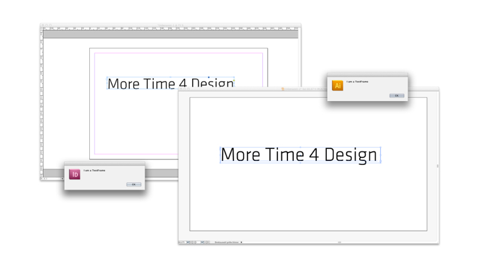
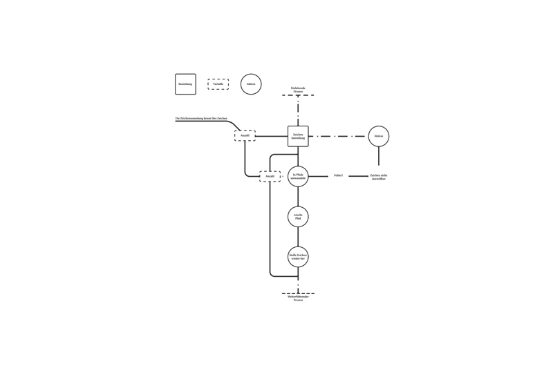
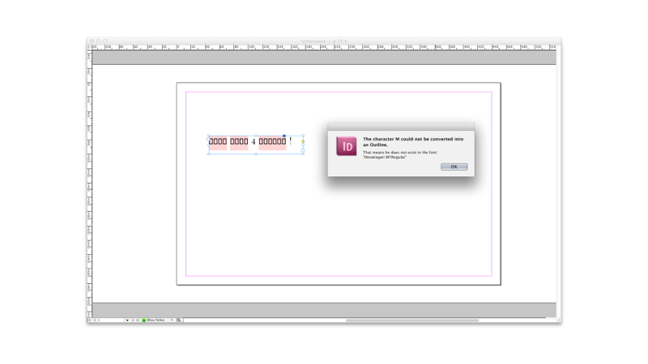
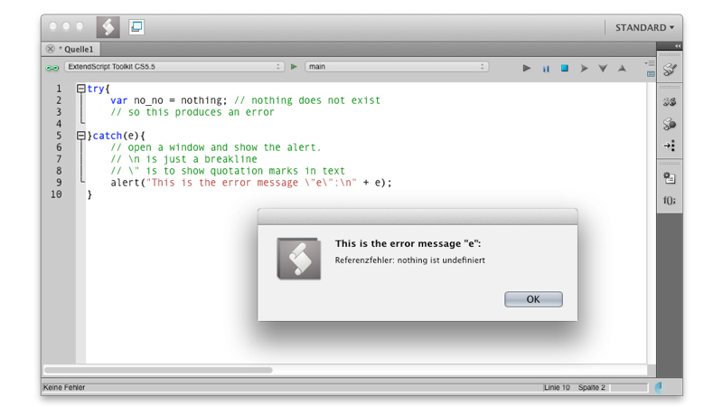

##2 Wann Soll Ich Skripten

> "Scripting languages assume that there already exists a collection of useful components written in other languages. Scripting languages aren't intended for writing applications from scratch; they are intended primarily for plugging together components."  
> Scripting: Higher Level Programming for the 21st Century von John K. Ousterhout ([online](http://www.tcl.tk/doc/scripting.html))  

Auch wenn Aufgaben auf unterschiedliche Weise mit verschiedenen Programmiersprachen gelöst werden können, haben sich spezielle Anwendungsgebiete für die einzelnen Sprachen ergeben. Ganz unabhängig davon, dass sich in unserem Fall Adobe Anwendungen mit JavaScript ansprechen lassen, macht es Sinn, eine Skriptsprache zu verwenden, um die bereits in höheren Sprachen implementierten Funktionen zu verbinden. JavaScript ist unser "Kleber". Wir können es benutzen um unseren Arbeitsablauf durch gezielte Befehlsketten von repetitiven Aufgaben zu befreien. Ich bin mir sicher, dass ein Großteil aller Gestalter, die vorgefertigte Software für ihre Arbeit verwenden, schon an den Punkt kamen, wo sie sich dachten: "Warum kann mein Programm **DAS** <a data-toggle="modal" href="#myModal1" ><i class="icon-asterisk"></i></a> nicht, es ist doch alles da. Der Knopf und danach diesen Knopf!".  
"Scripting" erlaubt es uns, diese beiden Knöpfe miteinander zu verbinden. Das bedeutet dann, dass wir unsere Arbeit um einen "Klick" reduziert haben. Wir haben zwei Knöpfe durch Verkettung auf einen neuen Knopf gelegt. Natürlich klingt die Reduktion um einen "Klick" vernachlässigbar. Wenn jedoch diese zwei "Klicks" 100-mal ausgeführt werden müssen und wir durch logische Anweisung diese ebenfalls auf nur einen Knopf zusammenführen können, ist der Zeitgewinn enorm. Ebenfalls muss hier erwähnt werden, dass viele der Probleme, die in einem Gestaltungsprozess auftreten, nicht zum ersten Mal bei eben dieser Person auftreten. Für den Bereich "Scripting" von Adobe-Anwendungen gibt es im Netz viele Seiten und Foren, die sich mit diesem Thema befassen. Im Bereich JavaScript gibt es noch viele mehr, da JavaScript auch verwendet wird beziehungsweise entwickelt wurde, um Browser zu steuern. Aufgrund dessen ist die Dokumentation mehr als ausgiebig. Es bedarf nur etwas Übung, um die gefundenen Beispiele zu lesen und auf die eigene Problemstellung zu abstrahieren.  

    
  

    <button class="close" data-dismiss="modal">×</button>
    <h3>Anmerkung</h3>
  

  

    
<!-- here comes the text --><strong>DAS</strong> steht hier für eine gewünschte Funktionsweise.

  

#Hierbei Sei Zu Beachten!   

    
  

    <button class="close" data-dismiss="modal">×</button>
    <h3>Anmerkung</h3>
  

  

    
Ein Algorithmus ist ein logische Verkettung von Operationen siehe <a href="10terminologie.html#16">Abschnitt 7.03</a>.

  

"Scripting" kann keine Design-Entscheidungen fällen. Es existiert kein Algorithmus, der Ästhetik simuliert. <a data-toggle="modal" href="#myModal2" ><i class="icon-asterisk"></i></a> Um eine spannende Komposition zu schaffen, braucht der Gestalter "nur" drei geometrische Grundformen zu erzeugen und diese im richtigen Verhältnis zu einander anzuordnen. Um dies programmatisch zu lösen, müsste ein Skript mehrere hundert Mal ausgeführt werden. Jedes Mal mit einer kleinen Veränderung der Koordinaten, der oben genannten drei Objekte. Irgendwann muss der Autor eintscheiden, welche Komposition spannend ist. Was das Skript leisten kann, ist anhand von bestimmten Rahmenparametern eine Fülle von Varianten zu liefern, die manuell ausgeführt Sehnenscheidenentzündungen hervorrufen würden. Programmieren ist nicht einfach. Es ist, wie eine neue Sprache zu erlernen. Stellen sie sich vor, sie sind in einem fremden Land, dessen Sprache sie nicht beherrschen. Sie werden zuerst Probleme haben, sich zu verständigen. Dann lernen sie, ihre Grundbedürfnisse zu decken. Ab einem gewissen Punkt können sie Tageszeitungen lesen, Inhalte erfassen und abstrahieren. Eines Tages werden sie feststellen, dass sie in der Sprache träumen. Der Vorteil an Computersprachen im Vergleich zu "Menschensprachen" ist, dass in der Computersprache kein Raum für Interpretation vorhanden ist. Jede Aussage **MUSS**, im Gegensatz zur zwischenmenschlichen Kommunikation, eindeutig sein. In [Quellcode](10terminologie.html#14) ist kein Raum für Interpretation. Die [Syntax](10terminologie.html#17) muss valide sein. Dies ist ein Vorteil, da es Genauigkeit bedingt. Dennoch, eine Sprache lernen, ist keine leichte Aufgabe.  
Daher sollten sie, bevor sie in die Tiefen von JavaScript abtauchen, um ein Problem zu lösen, entscheiden:  
  
* [Welche Operationen sollen ausgeführt werden?](#37)  
* [Wie komplex sind die Operationen?](#38)  
* [Wie groß ist das Zeitfenster und wann muss das Produkt fertig sein?](#39)  
* [Wie oft muss diese Tätigkeit ausgeführt werden?](#40)  
* [Lässt sich die Automation auch auf andere, ähnliche Bereiche anwenden oder mit geringem Aufwand abstrahieren?](#41)  
* [Wie sehr ist sie von Umgebungsvariablen abhängig?](#42)  
* [Soll die Automation von Dritten genutzt werden?](#43)  
* [Ist der Prozess linear oder bedarf es einer Rückkopplung zum Benutzer?](#44)  

Und einige Punkte, die sich hauptsächlich durch Recherche, die bereits vor dem ersten Entwurf erledigt sein sollte, abarbeiten lassen:  

* [Existieren bereits Automationen in dem Sektor und, wenn ja, lassen sich diese abwandeln?](#45)
* [Bietet die](#46) [API](10terminologie.html#23) [direkten Zugriff auf die benötigten Funktionen oder braucht es eine](#46) [Workaround](10terminologie.html#28)?   

Diese Analyse kann keine genauen Angaben über Zeit und Aufwand machen, da dies immer auch vom Erfindungsreichtum des Autors abhängig ist. Der Kreative kommt hier schneller zum Ziel.  
 

###2.0.1 Welche Operationen sollen ausgeführt werden?  

Programme oder Skripte schreiben, ist nicht wie "Scribbeln". Wir können beim Telefonieren einen Stift in die Hand nehmen und drauf los kritzeln. Beim Programmieren muss das Ergebnis bereits definiert sein, bevor geschrieben wird. Natürlich ergeben sich auch während des Schreibens neue Ideen, dennoch muss eine konkrete Vorstellung existieren, was das Ziel sein soll. Auch dies ist mit Sprechen zu vergleichen. erst denken - dann reden.  

###2.0.2 Wie komplex sind die Operationen?  

Wenn eine Fülle von unterschiedlichen Operationen ausgeführt werden soll, müssen auch entsprechend viele Anweisungen an das Programm erfolgen und der Autor muss sich auf eine längere Entwicklungszeit einstellen. Wenn es hingegen darum geht, einige Operationen 1000-mal auszuführen, kann es sein, dass sich der Kern des Skriptes auf zehn Zeilen reduziert. Dies bedeutet auch, dass die Zeit für Entwicklung und "Debugging" relativ gering sein und sich der Zeitaufwand lohnen kann.<a data-toggle="modal" href="#myModal3" > <i class="icon-asterix"></i> </a>  

    
  

    <button class="close" data-dismiss="modal">×</button>
    <h3>Anmerkung</h3>
  

  

    
Ein Bug ist ein Fehler im Programm. Debugging ist der Prozess der Fehlersuche. Siehe Abschnitt <a href="10terminologie.html#10">7.13 Was ist ein Bug?</a> und <a href="10terminologie.html#27">7.14 Was ist Debugging?</a>.

  

###2.0.3 Wie groß ist das Zeitfenster und wann muss das Produkt fertig sein?  

Auch hier muss, abhängig von der Komplexität des Skriptes und dem eigenem Vermögen, geurteilt werden, ob dies in dem gegebenen Zeitraum recherchiert, entworfen, geschrieben und "debugged" werden kann. Hinzu kommt, dass das Ergebnis meist nur ein Teilergebnis ist und noch weiterverarbeitet werden muss. Es ist davon auszugehen, dass etwaige tiefere Fehler erst während des vollen Einsatzes auftreten. Wenn dies in dem entsprechenden Zeitraum nicht zu bewerkstelligen ist, sollte von einer Entwicklung abgesehen werden.

###2.0.5 Wie oft muss diese Tätigkeit ausgeführt werden?  

Wenn das Skript nur ein einziges Mal ausgeführt werden soll, sollte man sich fragen, wo darin der Nutzen liegt. Es kann natürlich sein, dass dies Sinn und Zweck hat und sollte nur bedingt ausschlaggebend sein. Hierbei gilt es zu unterscheiden, dass einmalig 1000-mal einen Knopf drücken, bereits eine Hilfe sein kann. Einmalig 1000-mal unterschiedliche Knöpfe drücken, ist eine Aufgabe, die doch besser manuell geschieht.  

###2.0.6 Lässt sich die Automation auch auf andere, ähnliche Bereiche anwenden oder mit geringem Aufwand abstrahieren?  

Wenn dies der Fall ist, steigt der Nutzen der Arbeit. Der einmalige Aufwand ein Programm oder Skript für eine immer wieder kehrende beziehungsweise ähnliche Aufgabe zu schreiben, rentiert sich durch jede weitere Ausführung. Dies soll heißen: Durch das Schreiben des Programms, das ich immer wieder verwende, spare ich Zeit in der Zukunft. 

###2.0.7 Wie sehr ist sie von Umgebungsvariablen abhängig? 

Kann das Skript unabhängig von allen Variablen, die der Benutzer setzen kann, ausgeführt werden, vereinfacht das den Aufwand. Bei einer Abhängigkeit erfordert es immer erst einer Abfrage des "Ist-Status".  
Ein kleines Beispiel: In Illustrator oder InDesign wird die aktuelle Auswahl des aktiven Dokuments in einer Liste, genannt "selection", geführt.  

 

    
    app.activeDocument.selection;
    


In dieser Liste liegen einzelne Objekte, die beispielsweise Text, eine Vektor-Form oder ein Bild sein können. All diese haben gemeinsame Eigenschaften, aber auch spezielle. Es muss also, bevor eine Eigenschaft genutzt oder verändert werden kann, eine Abfrage stattfinden, welche Art von Objekt enthalten ist. Das nachfolgende Beispiel funktioniert in InDesign und Illustrator gleich. Es wird der Name des ersten Objekts in der Selektion abgefragt, wenn dies eine Textbox ist, gibt das Skript eine Meldung zurück.   

 

    
    // InDesign & Illustrator
    var firstListItem = app.activeDocument.selection[0]; // first object in selection 
    if(firstListItem instanceof TextFrame){ /* check the type */
    alert("I am a " + firstListItem.constructor.name);    // and name it
    }
      


  

Viele solcher Abfragen können ein Skript schnell komplex werden lassen. Oder anders ausgedrückt, je universeller der Nutzen sein soll, desto mehr Umgebungsvariablen müssen beachtet werden. Dies benötigt Zeit.  

###2.0.8 Soll die Automation von dritten Benutzt werden?  

Dies ist ein wichtiger Faktor. Wenn nur der Autor selbst die Automation verwendet, kann er seine vorhergehenden Aktionen auf die Bedürfnisse und Beschränkungen des Skriptes anpassen. Wenn jedoch eine unbedarfte oder schlimmer noch eine dem "Skripten" nicht mächtige Person dieses Werkzeug nutzen soll, müssen wie bereits oben erwähnt, viele Umgebungsvariablen abgefragt oder selber bestimmt werden. Im Programmier-Slang sagt man: "Man muss vom DAU<a data-toggle="modal" href="#myModal4" ><i class="icon-asterix"></i></a> ausgehen." Dies ist nicht als Beleidigung gedacht. Es soll eher sagen, dass alle Benutzerfehler, die auftreten können, auftreten werden. In diesem Fall bekommt jemand, der nicht programmieren kann, wenn er Glück hat, nur eine Fehlermeldung. Im schlimmsten Falle führt es zu einem Programmabsturz. In beiden Fällen steigt die Hemmung des Nutzers ungemein, das Skript noch einmal zu verwenden. Wenn also Dritte mit ins Spiel kommen, erfordert es noch längere Test- und Debug-Phasen.  

    
  

    <button class="close" data-dismiss="modal">×</button>
    <h3>Anmerkung</h3>
  

  

    
Dümmster Anzunehmender User

  

###2.0.9 Ist der Prozess linear oder bedarf es einer Rückkopplung zum Benutzer?  

Wenn dem so ist, sollte der Prozess vielleicht in mehrere Skripte zerlegt werden. Für den Fall, dass Variablen von einem Skript an das nächste übergeben werden müssen, kann dies die Komplexität weiter erhöhen. Hierbei gibt es die Möglichkeiten, eigene Textdateien, in denen Werte abgelegt werden können, vom Skript kreieren zu lassen. Die Verwendung von Textdateien kann ihre Tücken haben. Auf unterschiedlichen Betriebssystemen werden Dateipfade unterschiedlich gehandhabt. Auch dies will abgefragt und getestet werden. Weiterhin ist es möglich, ein "Script Panel" zu erzeugen, das solange es aktiv ist Werte beinhaltet.<a data-toggle="modal" href="#myModal5" ><i class="icon-asterix"></i></a>
Eine weitere Option ist die Verwendung einer `targetengine`, in der, solange das **Programm** aktiv ist, Daten gespeichert werden. Die letzten beiden sind jedoch fortgeschrittene Lösungen, die ebenfalls viele Stolpersteine beherbergen können.   

    
  

    <button class="close" data-dismiss="modal">×</button>
    <h3>Anmerkung</h3>
  

  

    
 Ein "Script Panel" ist eine Erweiterung der grafischen Oberfläche, die es erlaubt, während das Skript läuft, weiterhin mit dem Programm zu interagieren.

  

###2.1 Das Beispiel targetengine  

Skript 1:  

 

Skript 2:  

 

Der Algorithmus lautet wie folgt:  

 

  
Skript 1:  

    //
    #targetengine "session01"
    var myValue = 0; // new value
    alert(myValue); // result is 0
    myValue++; // increment by 1
    
Skript 2:  
    //
    #targetengine "session01"
    alert(myValue); // result is 1
    

Der Algorithmus lautet wie folgt:  

    //
    Start  
    Sitzung 1
    definiere Variable meinWert und Speicher 0 in ihr
    zeige Wert von meinWert
    erhöhe meinWert im eins
    Stop  
    
    Start  
    Sitzung 1
    zeige Wert von meinWert
    Stop  
    //


Dies bedeutet, dass das Programm (nicht das Skript) sich den Wert für die Variable `myValue` gemerkt hat und ihn solange in `#targetengine "session01"` speichert, bis es beendet wird. Hier liegt die Gefahr darin, Bezeichnungen für Variablen doppelt zu vergeben. In vielen meiner Skripte speichere ich das aktive Dokument in der variable `doc`. Wenn diese nun in einer `targetengine` liegen, wird das Programm immer auf das zuletzt `doc` gleichgesetzte Objekt zugreifen. Dies geschieht auch wenn der Nutzer es nicht wünscht, sondern es lediglich nicht beachtet hat.  
  
Die Recherchearbeiten sollten bereits vor dem ersten Entwurf erledigt sein.

###2.1.1 Existieren bereits Automationen in dem Sektor und, wenn ja, lassen sich diese abwandeln?  

Wie bereits oben erwähnt, sind viele Probleme bereits einmal aufgetreten. Wenn das Problem nicht all zu speziell ist, kann es gut sein, dass es bereits ein Skript gibt, das entweder genau diese Funktion enthält und, wenn nicht, auf die eigenen Bedürfnisse angepasst werden kann. Meist is es der Fall, dass es mehrere Skripte gibt, die Teilprozesse der eigenen Idee beinhalten und als Referenz benutzt werden können. In den seltensten Fällen entsteht ein Skript nicht aus einem blanken Textdokument. 
  

###2.2 Bietet die API direkten Zugriff auf die benötigten Funktionen oder bedarf es eines Workaround?  

###2.2.1 Das Beispiel try char   

Um Punkt 2.2 zu erläutern, möchte ich mich eines Beispiels bedienen. InDesign kann nicht erfragen, ob ein Zeichen in einer Schriftart enthalten ist. Ein Zeichen hat kein Eigenschaft, die Font has Character oder ähnliches beinhaltet. Um diese Abfrage zu simulieren, hat Peter Kahrel<a data-toggle="modal" href="#myModal6" ><i class="icon-asterix"></i></a> die Funktion try\_char() geschrieben, die hier in einer etwas abgewandelten Form folgt. Um die folgende Funktion try_char() sinnvoll ausführen zu können, benötigen sie ein InDesign Dokument mit einer Textbox auf der ersten Seite. In dieser Box muss Text enthalten sein, der Zeichen beinhaltet, die in dieser Schriftart nicht dargestellt werden können. (siehe Bild) 

    
  

    <button class="close" data-dismiss="modal">×</button>
    <h3>Anmerkung</h3>
  

  

    
Peter Kahrel ist einer der präsentesten InDesign Skripter und Autor von "InDesign mit JavaScript automatisieren" erschienen im O'Reilly Verlag

  

  

  


    
    var tf = app.activeDocument.pages.item(0).textFrames.item(0);
    for(var i = 0; i < tf.characters.length;i++){
    var theChar = tf.characters.item(i);
    try_char (theChar);
    };
    // original function by Peter Kahrel 
    // http://www.kahrel.plus.com/indesign/compose_cs3.jsx
    // edited by fabiantheblind
    function try_char (theChar){  
    try {  
         // save the character 
        var storage = theChar.contents; 
         // create outline  
         theChar.createOutlines();  
         // if we got here it worked, so delete the outline
         // if not the next line will be within the catch block  
        // if not it will cause an error  
         theChar.remove();  
         // insert the character (again)  
         theChar.contents = storage;  
         } catch(e){  
         alert("The character "+ theChar.contents + 
         " could not be converted into an Outline.\n"+
         "That means he does not exist in the font:\n\""
         + theChar.appliedFont.name+"\"");
         }  
     } 
     


 

Die Funktion `try_char` erledigt folgende Aufgaben.  
Sie bekommt eine Zeichen als Parameter. Dieses speichert sie temporär in einer Variablen. Dann wird das Zeichen genommen und InDesign versucht es, in Pfade umzuwandeln. Dies kann nur passieren, wenn das Zeichen in der Schrift auch existiert. Sollte dem so sein, wird die neu kreierte Vektor-Form wieder verworfen und das Zeichen wird aus dem Zwischenspeicher wieder hergestellt. Wenn jedoch die Umwandlung einen Fehler erzeugt, wird dieser aufgefangen. Damit weiss das Skript ob das Zeichen darstellbar ist oder nicht.  
  
Dies passiert mit dem Konstrukt `try { } catch (e) { }. Sollte der Inhalt der ersten geschwungenen Klammer, oder auch Block genannt, einen Fehler erzeugen, wird dieser abgebrochen und das Skript führt den Zweiten Block aus. Die Variable e ist in diesem Fall die Fehlermeldung. Probieren sie es mit dem folgendem kurzen Skript aus. Das Programm wird sie warnen, dass die Variable nothing nicht existiert.   

 

    
    try{
    var no_no = nothing; // nothing does not exist
    // so this produces an error
    }catch(e){
    // open a window and show the alert.
    // \n is just a breakline
    // \" is to show quotation marks in text
    alert("This is the error message \"e\":\n" + e);
    }
    


  

Das Programm wird sie warnen, dass die Variable `nothing` nicht existiert.  
Solche Lösungen setzen nicht nur einen kreativen Umgang mit [Code](10terminologie.html#14) voraus, sondern auch ein tiefes Wissen über die Funktionsweise und Möglichkeiten innerhalb von, in diesem Falle, InDesign. Die oben genannten Hindernisse schrecken ab. Es ist jedoch sehr allgemein gehalten und manche Fragen stellen sich auch erst gar nicht. Bei Aufgaben die ein «Normal-Nutzer» niemals manuell machen würde, muss sogar ein Skript geschrieben werden, wenn sie erledigt werden sollen.  
Auch wenn der Prozess des Skript-Schreibens eine kreative Arbeit ist, ist das Ziel des Skriptes nicht der kreative Output, sondern die Optimierung der eigenen Arbeitsabläufe. Das Skript oder Programm kann niemals die Idee liefern. Es unterstützt den Prozess indem es sich wiederholende Aufgaben erledigt, die entweder niemals gemacht worden wären oder aber vom eigentlichen, kreativem Prozess ablenken.    


[^DAS]: **DAS** steht hier für eine gewünschte Funktionsweise.  
[^ALGO1]: Ein Algorithmus ist ein logische Verkettung von Operationen siehe Abschnitt
[^Scriptpanel]: Ein "Script Panel" ist eine Erweiterung der grafischen Oberfläche, die es erlaubt, während das Skript läuft, weiterhin mit dem Programm zu interagieren.  
[^PeterK]: Peter Kahrel ist einer der präsentesten InDesign Skripter und Autor von "InDesign mit JavaScript automatisieren" erschienen im O'Reilly Verlag  
[^BUG] Ein Bug ist ein Fehler im Programm. Debugging ist der Prozess der Fehlersuche. Siehe Abschnitt [7.13 Was ist ein Bug?](10terminologie.html#10) und [7.14 Was ist Debugging?](10terminologie.html#27)  

[^DAU]: Dümmster Anzunehmender User  


