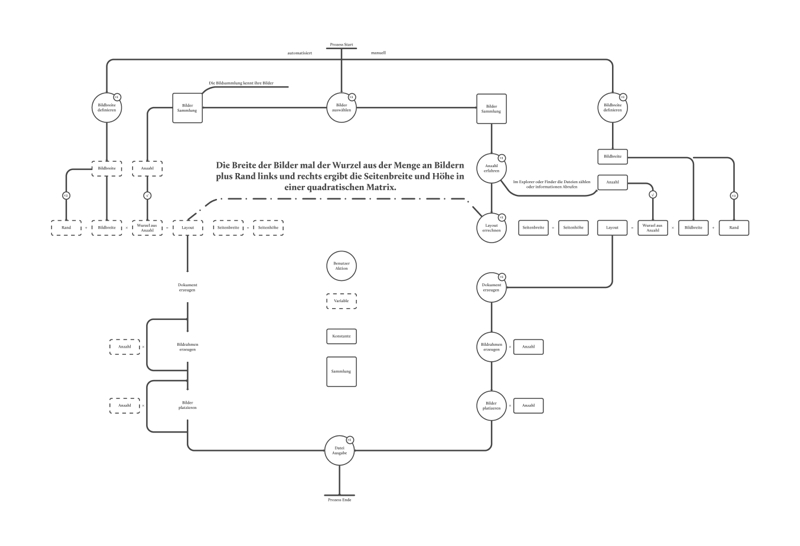

##3 Szenarien

Um besser zu verstehen, was das Skript leisten kann, soll hier ein Fallbeispiel aufgemacht werden, vor dem jeder Layouter einmal stehen könnte. Stellen sie sich vor ihre Aufgabe ist folgende:  
###Erzeugen sie eine quadratische Bildmatrix in InDesign aus einer definierten Anzahl an quadratischen Bildern mit einer festen Grösse.  
  

Dies würde bedeuten, dass wir zum Beispiel 4×4 also 16 Bilder darstellen wollen. Es folgt eine grafische Gegenüberstellung des automatisierten (links) und manuellen (rechts) Prozesses.  
Bei 16 Bildern kommen wir auf 38 Aktionen. Mit einem Skript haben wir 3 Aktionen. Wenn es eine 10×10 Matrix sein soll, sind das 206 Aktionen. Im Skript sind es weiterhin 3. Der Kern der Aufgabe ist das errechnen des Layouts. Dies muss in der manuellen sowie in der automatisierten Variante passieren. Demzufolge kommt der Gestalter, der sich für die manuelle entschieden hat, nicht um das Errechnen des Layouts herum. Da wir von Prozessen im "Gestalter-Alltag" reden, kann es gut vorkommen, dass ein Kunde eine solche Aufgabe an sie stellt.  
Verändern wir die Aufgabe noch ein wenig:  

###Erzeugen Sie eine Bildmatrix in InDesign aus einer noch nicht definierten Anzahl an quadratischen Bildern mit einer festen Grösse.

Um dieser Anforderung gerecht zu werden, müssen wir in der automatisierten Variante eine Kondition einführen.  
####Wenn die Wurzel der Bildmenge eine Fließkommazahl ist, ist die Seitenhöhe die Seitenbreite plus eine Bildbreit.  

  