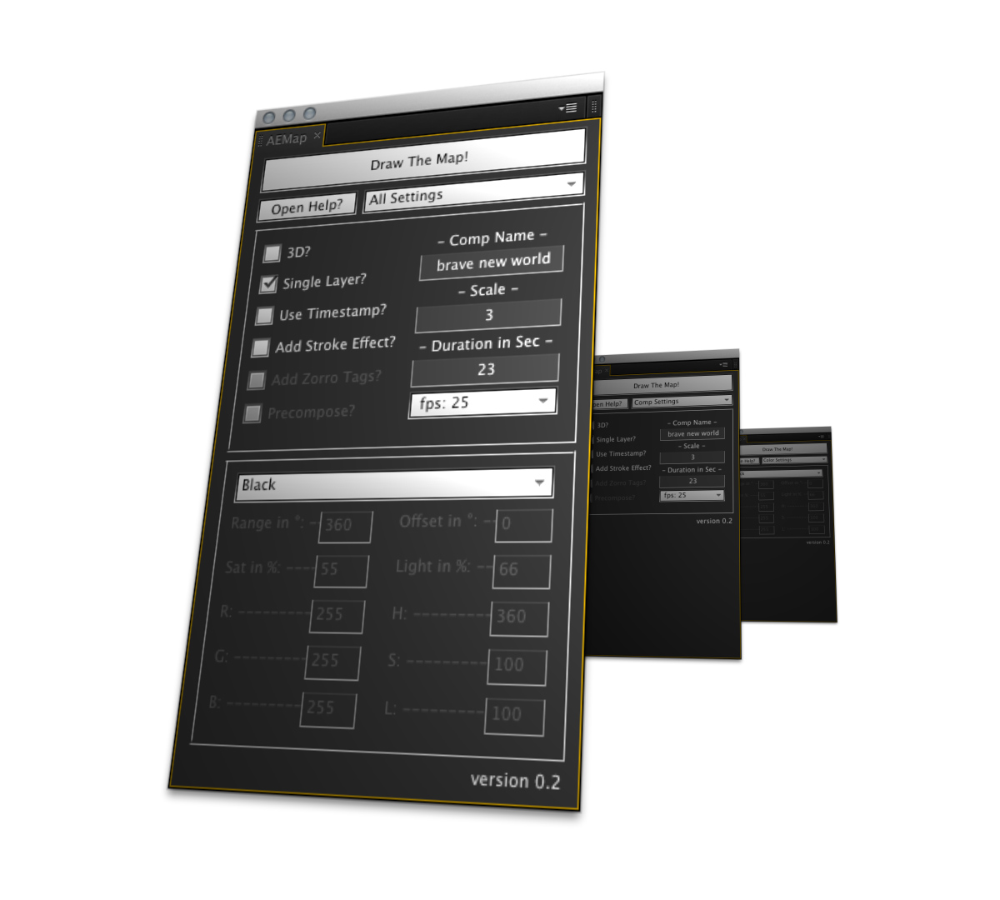
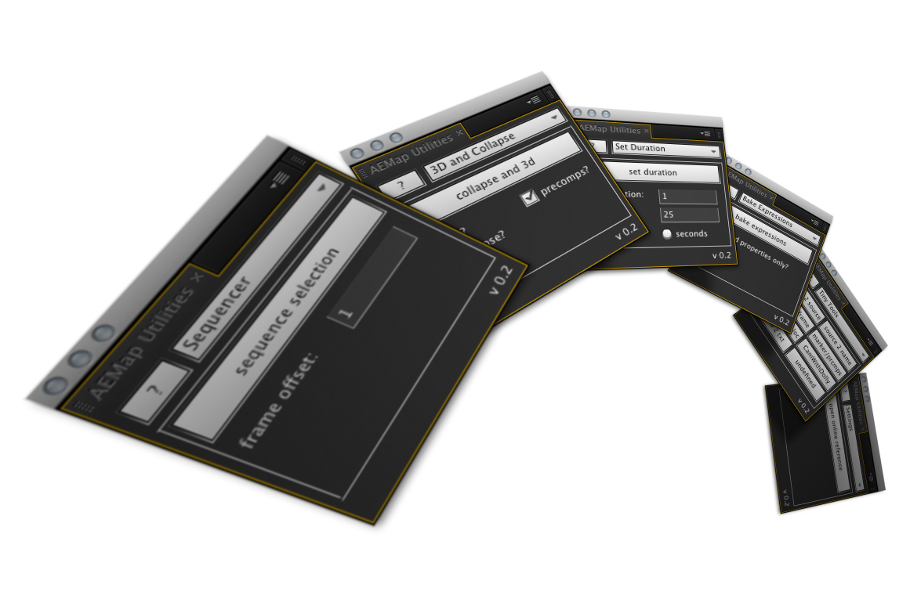
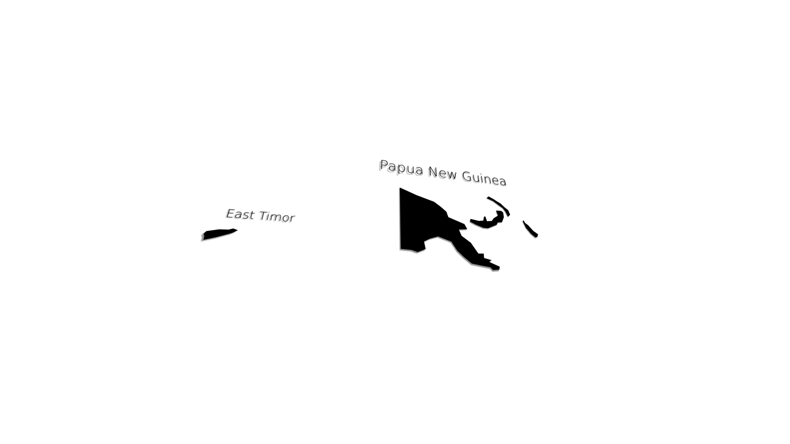
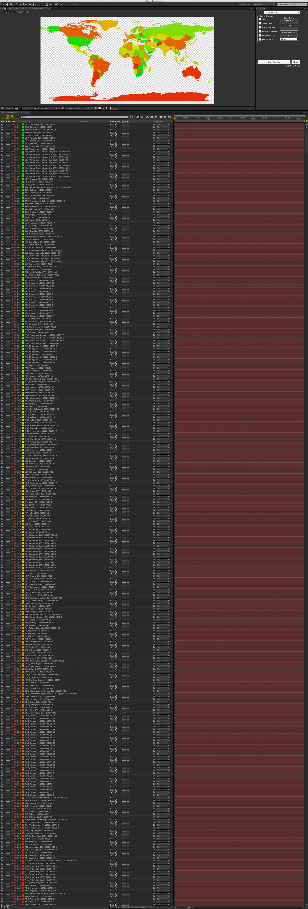

##4Werkzeuge
Wo bleibt die extra Zeit für Gestaltung die versprochen wurde? Wie bereits erwähnt braucht das lernen einer Sprache etwas Zeit. Die Grammatik und Rechtschreibung können aus einem Buch gelernt werden, die Nuancen und Umgangssprache kann jedoch nur durch das Sprechen geschult werden. Zum Glück sind wir hier nicht alleine. Es gibt bereits viele Werkzeuge die frei zur Verfügung stehen und zur Optimierung unserer Arbeitsprozesse genutzt werden können. Dies kann von kleinen Helfern wie "greatPower.jsx" bis zu voll ausgearbeiteten Systeme mit eigene Grafischen Benutzeroberflächen gehen. In diesem Sinne habe ich die Skripte AEMap.jsx und AEMap Utilities.jsx für Adobe After Effects geschrieben. Und unter einer Open Source Lizens ins Netz gestellt.  

  

Viele Motion Designer kommen irgendwann einmal an den Punkt an dem sie eine Weltkarte oder die Aussenkontur eines Landes benötigen. Bisher war es so das immer wieder eine Websuche begann nach benutzbaren Kartenmaterial. Hierbei entstehen einige Problem. Die Rechte an Kartenmaterial das "einfach so" aus dem Netz gezogen wurde sind oft ungeklärt. Manchmal sind es Vektor-Dateien wenn man Pech hat sind es Pixelbilder. Diese Quelldatei liegt dann innerhalb eines Projektes und wird mit diesem archiviert. Wenn sie wieder benötigt wird beginnt die Suche aufs neue. Was bei vielen absolvierten Projekten schnell zeitraubend werden kann. After Effects Projekte können schnell aus hunderten Quelldateien bestehen und sind gerne nach persönlichem Gusto sortiert. Was wenn dann nicht nur eine Weltkarte sondern zum Beispiel die Kontur von Ost-Timor und Papua Neu Guinea benötigt wird?  

  

Selbst wenn eine vernünftige Vektor-Form einer Karte existiert und griffbereit ist wie könne die beiden Länder gefunden werden? Was ist wenn eine Grenzänderung stattfindet? Und und und. Um diesen Problemen zu entgehen kann AEMap.jsx eine Weltkarte in Rektangularprojektion erzeugen. Dabei entsteht eine After Effects Komposition in einer gewählten Skalierung (immer 2:1) in der 178 Prä-Kompositionen enthalten sind die 286 einzelne Polygon-Gruppen beinhalten.  

  

Der Nutzer kann zwischen verschiedenen Einstellungen wählen wie zum Beispiel die Karte mit Kontur zu zeichnen, ohne, ob alle Polygone auf eine Ebene gezeichnet werden sollen oder ob in die oben genannten Kompositionen gesplittet werden soll. Ebenfalls können 3D Einstellungen definiert werden und ähnliches mehr. Die Daten bestehen auf einem GeoJson Datensatz der zum freien Gebrauch ins Netz gestellt wurde. Der gesamten Funktionsumfang ist auf [dieser Webseite](http://fabiantheblind.github.com/AEMap/) dokumentiert. Dieses Skript spart nicht nur mir Zeit sondern auch anderen. Die Resonanz in der After Effects Community" ist gross. Daher hat das Skript seit seiner Veröffentlichung auf [AEScripts.com](http://aescripts.com/aemap/) am 10 April 2012 bereits über 550 Downloads gehabt (heute 4 Mai 2012). Das Tutorial und das Demo wurden bereits über 5000 mal auf Youtube geladen. Aber genug der Selbstbeweihräucherung. Der Vorteil an solchen und ähnlichen Werkzeugen die zum Beispiel auf AEScripts.com bereit gestellt werden ist, dass diese meist aus dem Zwang heraus entstanden sind einen Arbeitsablauf zu automatisieren um Zeit zu sparen.  

Ein weiteres Werkzeug zum Multipublishing, das ich noch nicht umgesetzt habe und auch vielleicht niemals umsetzen werde wäre folgendes. Zum schreiben dieser Arbeit Benutze ich eine Auszeichnungssprache genannt [Markdown](http://daringfireball.net/projects/markdown/) in einem Editor genannt [iAWriter](http://www.iawriter.com/).[^markdown]  

	
	#Überschrift 1
	##Überschrift 2
	**Fett** oder __Fett__  
	*Italic* oder _Italic_  
	  

Der obige Text wird nach dem Übersetzen durch mein [CSS (Cascading Style Sheets)](http://www.w3schools.com/css/css_intro.asp) gesteuert so dargestellt:

#Überschrift 1
##Überschrift 2
**Fett** oder __Fett__  
*Italic* oder _Italic_  

Mit iA Writer habe ich einen Weissen Bildschirm und bin frei von jedweder Ablenkung. Mit diesem Set (Markdown + iA Writer) bin ich voll auf Text konzentriert und lasse mich nicht von Layoutaufgaben stören. Um diese Texte in ein lesbare und mit CSS gestaltbare Form zu bringen benutze ich [Jekyll](http://jekyllrb.com/). Jekyll ist eine in Ruby geschriebener Markdown-Übersetzer der statische .html Dokumente exportiert. Mit einem in Ruby geschriebenem Jekyll Plugin **könnte** neben dem .html auch eine für InDesign verständliche Datei erzeugt werden ein .idml (InDesign Markup Language). Ebenfalls könnte ein .epub (Electronic Publication) oder ein [RSS-Feed (Rich Site Summary)](http://www.whatisrss.com/) erzeugt werden. Alle drei sind offene Standarts und basieren auf der [.xml( EXtensible Markup Language)](http://www.w3schools.com/xml/xml_whatis.asp) Formatdefinition.
Diese Pipeline kann mit unterschiedlichen Templates für verschiedenste Formate gesteuert werden. Dies bedeutet wiederum nicht, dass fertige Dokumente rauskommen. Auch hier gilt die erzeugten Ergebnisse der Automation sind nicht das Endergebnis sondern müssen noch weiterverabeitet werden. Es würde jedoch die Datenübertragung erleichtern und mit einer Anweisung in der Kommandozeile `jekyll --server` Rohdaten für verschiedenste Medien erzeugen. Diese müssten dann widerum einen Gestaltungsprozess durchlaufen.\[^jekyll\]  
Leider ist dies nur eine Idee. Um es umzusetzen müsste ich Ruby, das idml Schema, das epub Schema, mehr über xml, dtd, xslt, xPath, mehr über html und css und wie ich Plugins für Jekyll schreibe lernen. Dies ist in bis zum Ende dieser Arbeit nicht zu bewerkstelligen.  
Aber toll wäre es.  
Der aktuelle Prozess orientiert sich an dieser Idee ist jedoch nicht komplett automatisert. Die Markdown Dateien werden mit einem Skript zu einem InDesign Buch zusammengeführt and die Auszeichnungen werden in Absatzformate übersetzt. Alle referenzierten Bilder werden auf den entsprechenden Seiten platziert. Ab diesem Punkt wird der "Feinschliff" des Layouts manuell durchgeführt. Das Übersetzen der Auszeichnung wird durch Suchen und Ersetzten Routinen bewerkstelligt. Dies ist eine rohe Art der Transformation. Es wäre sinnvoller die Übersetzung nicht mit einem Workaround zu erledigen. Wie bereits oben erwähnt fehlt jedoch dafür die Zeit.  

[^markdown]: Die Auszeichnungssprache Markdown wurde von [John Gruber](http://daringfireball.net/) entwickelt und erlaubt es in reinem Textdokumenten Auszeichnungen wie Überschrift 1 oder Zitat zu verwenden ohne dass der Lesefluß maßgeblich beeinträchtigt wird.  

[^jekyll]: ?]Mit 4 Befehlen könnte dies schon auf einem Webserver bereitgestellt werden.  

	
	jekyll --server
	git add --all
	git commit -m "This is the message describing the commit"
	git push origin master
	

Damit sind die Daten im Netz verfügbar und können eingesehen werden. Hier könnte ein online Korrektursystem mit differenzierten Nutzerrechten eingebunden werden und und und...  