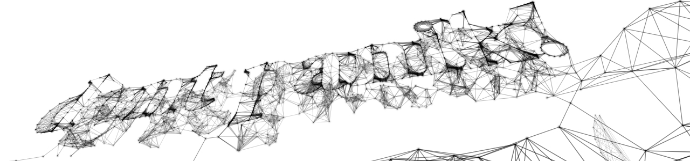

##5 Die Angst

Wann immer ich gefragt werde, über was ich schreibe oder womit ich mich beschäftige und ich antworte: "Grafik und Programmieren", stosse ich auf die Aussage: "Das werde ich nie lernen." Woher kommt diese Annahme? Auf der [TEDxVancouver im November 2011 beschreibt Jer Thorp](http://www.ted.com/talks/lang/en/jer_thorp_make_data_more_human.html) eine Situation, die gut unseren aktuellen Zustand darstellt:  
Wenn man vor 30 Jahren einem Programmierer gesagt hätte: "In 30 Jahren haben alle einen Computer, aber keiner wird wissen wie man programmiert", hätte dieser gesagt: "Das ist nicht möglich". <a data-toggle="modal" href="#myModal1" ><i class="icon-asterisk"></i></a> Computer haben sich von den Rechenmaschinen der Spezialisten zu einem alltäglichen Ding entwickelt, das wir nutzen und akzeptieren, dem wir aber nicht unter die Haube gucken möchten. 

    
  

    <button class="close" data-dismiss="modal">×</button>
    <h3>Anmerkung</h3>
  

  

    
 Jer Thorp <a href="http://blog.blprnt.com/">alias (@blprnt)</a> ist ein kanadischer Medienkünstler. Er ist derzeit Data Artist in Residence bei der New York Times und ist Lehrbeauftragtern an der Universität von New York im ITP (Interactive Telecommunications Program).

  

Oder anders:  

> „Jede hinreichend fortschrittliche Technologie ist von Magie nicht zu unterscheiden.“  
> Sir Arthur C. Clarke's Drittes Gesetz <a data-toggle="modal" href="#myModal2" ><i class="icon-asterisk"></i></a>  

    
  

    <button class="close" data-dismiss="modal">×</button>
    <h3>Anmerkung</h3>
  

  

    
Sir Arthur C. Clarke war ein britischer Science-Fiction Autor. Sein wohl bekanntestes Werk ist 2001: A Space Odyssey, welches von Stanley Kubrick verfilmt wurde und bei dem er ebenfalls Co-Autor war. Seine drei Gesetze sind folgende: 

<ol>
	<li>„Wenn ein angesehener, aber älterer Wissenschaftler behauptet, dass etwas möglich ist, hat er mit an Sicherheit grenzender Wahrscheinlichkeit Recht. Wenn er behauptet, dass etwas unmöglich ist, hat er höchstwahrscheinlich Unrecht.“</li>
<li>„Der einzige Weg, die Grenzen des Möglichen zu finden, ist ein klein wenig über diese hinaus in das Unmögliche vorzustoßen.“</li>
<li>„Jede hinreichend fortschrittliche Technologie ist von Magie nicht zu unterscheiden.“ </li>
</ol> 

  

  

Wir haben Computer und ihre Funktionsweise mystifizert. Ein "Klerus", den wir Programmierer nennen, erzeugt "Ohs" und "Ahs", aber wie dieser Zauber wirkt, wissen wir nicht. Da ich keinen Einblick in die derzeitige Situation an unseren Schulen habe, kann ich das Folgende nur aus meiner eigenen Erfahrung beurteilen. Ein frühes Vertrautmachen mit Computern gab es in meiner schulischen Laufbahn nicht. Wer Interesse hatte, konnte in die Computer-AG eintreten. Freiwillig. Bei einem eher musisch begabtem Menschen ruft dies natürlich wenig Begeisterung hervor. Ich denke, damit stehe ich nicht allein. Die Angst kommt vom Unbekannten. Um auf den Vergleich des Erlernens von Fremdsprachen zurück zu kommen - natürlich haben wir ein unwohles Gefühl, wenn wir uns dort aufhalten wo wir uns nicht auskennen. Wir werden weiterhin versuchen, so oft wir können, unsere eigene Sprache anstatt der Landessprache zu nutzen. Dies ist menschlich und ein wenig töricht.  
Mit dem Erlernen einer Computersprache vollzieht sich ein Wandel. Es ist der Schritt vom Bediener zu einem Macher von Werkzeugen. Die Programme, die wir als Grafiker nutzen, sind nach der Idee eines Teams von Menschen geformt. Wir haben keinen Einfluss auf die Funktionsweise. Mit dem Schreiben von Programmen oder Skripten kann dies überwunden werden.    


[^jt]: Jeff Thorp (@blprnt) ist ein kanadischer Medienkünstler. Er ist derzeit Data Artist in Residence bei der New York Times und ist Lehrbeauftragtern an der Universität von New York im ITP (Interactive Telecommunications Program).  
[^sacc]: Sir Arthur C. Clarke war ein britischer Sience-Fiction Autor. Sein wohl bekanntestes Werk ist 2001: A Space Odyssey welches von Stanley Kubrick verfilmt wurde und bei dem er ebenfalls Co-Autor war. Seine drei Gesetze sind folgende:  
1. „Wenn ein angesehener, aber älterer Wissenschaftler behauptet, dass etwas möglich ist, hat er mit an Sicherheit grenzender Wahrscheinlichkeit Recht. Wenn er behauptet, dass etwas unmöglich ist, hat er höchstwahrscheinlich Unrecht.“  
2. „Der einzige Weg, die Grenzen des Möglichen zu finden, ist ein klein wenig über diese hinaus in das Unmögliche vorzustoßen.“  
3. „Jede hinreichend fortschrittliche Technologie ist von Magie nicht zu unterscheiden.“  

