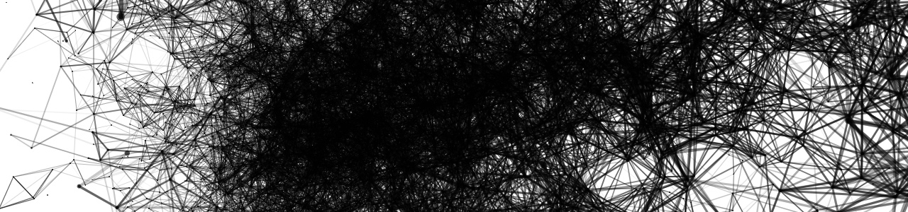

##6 Fazit

Programmieren ist nicht leicht, aber leichter als man denkt. Gerade der Anfang hat eine flache Lernkurve und der Lernende wird auch noch mit einem neuen und komplizierten Wortschatz konfrontiert. Ab einem gewissen Punkt ändert sich dies, aber der muss erst erreicht werden. Das Problem ist dabei, dass wir gerne von komplexen Systemen träumen, um solche umzusetzen, fehlt uns dann das Können. Denn zuerst gilt es, die einfachsten Schritte zu machen. Wir sind in ein Entwicklungsstadium zurückgeworfen, in dem wir noch nicht unsere Bedürfnisse formulieren können, aber möchten. Dies kann demotivierend sein. Wenn der flache Teil der Lernkurve endlich überwunden ist, kann diese Fähigkeit wie ein weiteres Werkzeug verwendet werden. Ab diesem Punkt eröffnet die Automation durch Programmierung für uns neue Welten in der Gestaltung. Aufgaben die einmal unmöglich schienen, können nun angegangen werden. Tausend Seiten mit tausend Bildern sind kein Problem. Hinzu kommt, dass beim Programmieren lernen sich ein neues Verständnis für die Logik von Computern bildet und deren Eigenheiten nicht mehr magisch sind. Dies nimmt die Angst vor der direkten Interaktion mit der Maschine. Ich denke nicht mehr, dass jeder programmieren lernen muss, um die Rechner, die wir haben, voll ausnutzen zu können, ist es jedoch unerlässlich. Denn mit den Programmen, die wir benutzen, kratzen wir nur an der Oberfläche ihrer Leistungsfähigkeit. Wir sind beschränkt auf die Funktionsweise, die ein anderer für uns entworfen hat, obwohl wir der Meinung sind, dass wir es eigentlich besser wissen. Ein weiterer Vorzug ist folgender. Nur wenn ich die Grundlagen einer Idee verstanden habe, kann ich darüber kommunizieren. Wie kann ein Gestalter eine Webseite planen, ohne ein wenig Verständnis für die Vorgänge und Funktionsweisen zu besitzen? Nur durch ein Grundverständnis können die Möglichkeiten, die dieses Medium bietet, gezielt eingeschätzt und ausgenutzt werden.  
Der Idealfall zum Erlernen von Computersprachen ist unter Zwang, beispielsweise wenn sie vor einem Problem stehen, das manuell nicht gelöst werden kann, aber gelöst werden muss. Alle anderen müssen sich selbst überwinden.  
Es kann vieles mit einer Automation durch Programmierung bewerkstelligt werden. Die Automation ist jedoch nicht die Lösung, sondern die Entschlackung unseres Arbeitsprozesses von geisttötenden Aufgaben. Jedes Programm oder Skript, welches wir schreiben, ist ein kreativer Prozess an dem wir unsere Fähigkeiten verbessern.  

Abschließen möchte ich mit einem Zitat von Marshall McLuhan um noch eine weiter Betrachtungsweise der Automation zu eröffnen.  

> Automation ist Information, und sie macht nun nicht nur den Spezialaufgaben im Bereich der Arbeit ein Ende, sondern auch der Auffächerung im Bereich des Lernens und Wissens. In Zukunft besteht die Arbeit nicht mehr darin, seinen Lebensunterhalt zu verdienen, sondern darin, im Zeitalter der Automation leben zu lernen. Das ist ein ganz allgemeines Verhaltensmuster im Zeitalter der Elektrizität. Es beendet die alte Dichotomie von Kultur und Technik, von Kunst und Handel und von Arbeit und Freizeit. Während im mechanischen Zeitalter der Fragmentierung Freizeit die Abwesenheit von Arbeit bedeutet oder bloßes Müßigsein, gilt im Zeitalter der Elektrizität gerade das Gegenteil.  
> Marshall McLuhan "Die magischen Kanäle - Understanding Media"
