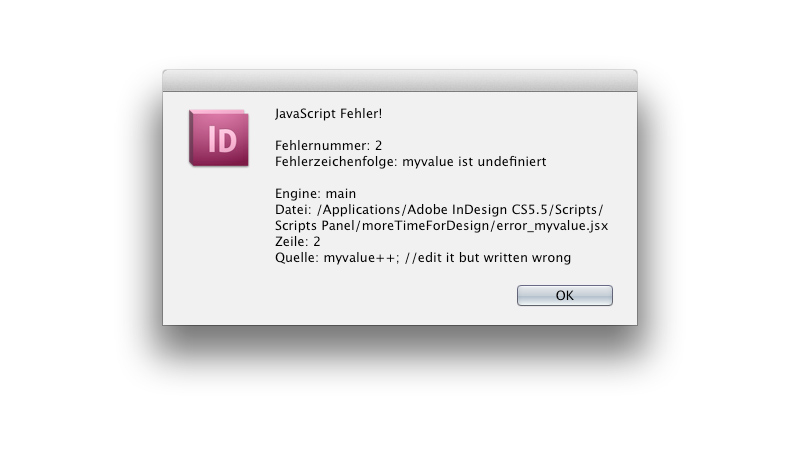
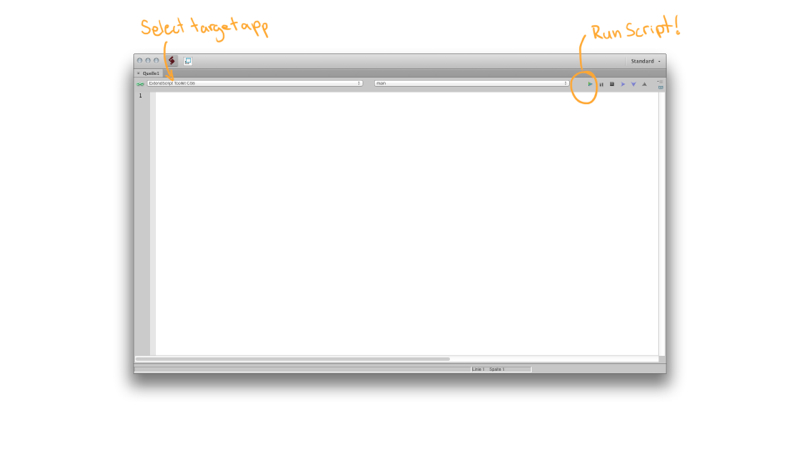
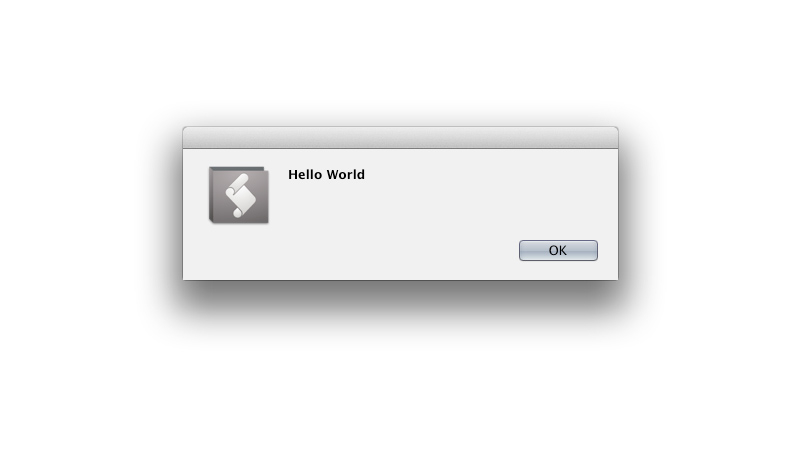
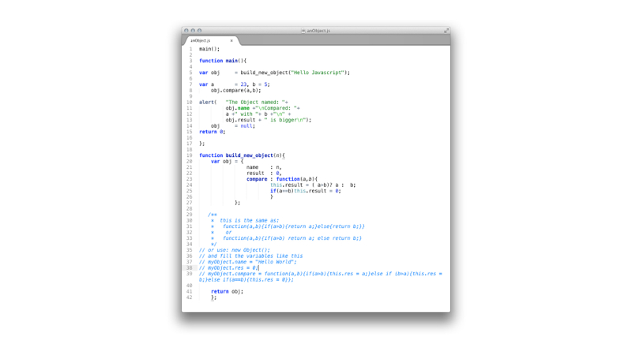
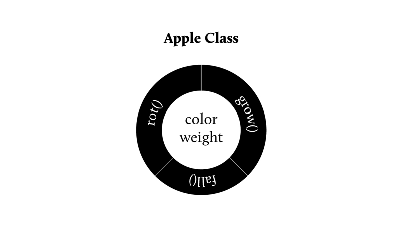
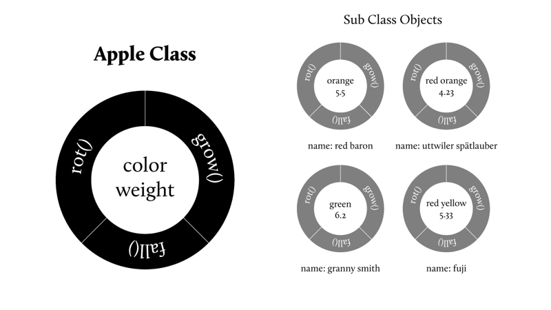
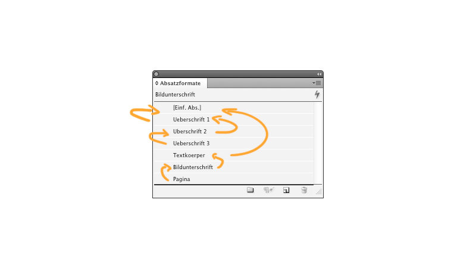
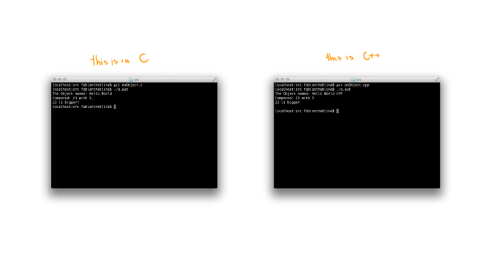

##7 Die kleine Terminologie 
Dieser Abschnitt ist zur Erläuterung gedacht und um den Lesefluss nicht durch Sekundärinformationen und Erklärungen von Fachbegriffen zu unterbrechen. 

###7.01 Was ist Code? 
Als Code bezeichnen wir in der Regel Informationen, die verschlüsselt (encoding) werden, um dann an einer weiteren Stelle wieder entschlüsselt zu werden (decoding). Zum Beispiel stellt Morse-Code Buchstaben dar, indem ein einziges unmoduliertes Signal, zum Beispiel ein Ton, in kurze und lange Sequenzen unterteilt wird. Der Rezipient kann dann, wenn er des Systems mächtig ist, diese Informationen entschlüsseln und zu der originalen Nachricht wieder zusammensetzen. Ein weiteres Beispiel ist der Abakus. Dieser erlaubt es, wenn der Benutzer des Systems mächtig ist, Rechenoperationen auszuführen. Und als drittes die Knotenschrift der Inkas, die, wie der Name bereits besagt, aus einem System von Knoten auf einem Satz Schnüren bestand. Heutzutage findet das Wort "Code" im Computerbereich oft Verwendung als Kurzform des Ausdrucks "Source-Code", also Quelltext eines [Programms](#15).  
  

###7.02 Was ist ein Programm? 
Das Bild, das viele im Kopf haben, wenn sie das Wort Programm hören, ist stark durch Film beeinflusst. Wir sehen junge, meist übergewichtig und verpickelte Menschen vor uns, die in abgedunkelten Räumen zwischen Monitoren, Kabeln und Pizzapackungen auf ewige grün leuchtende Zahlenkolonnen blicken, die für uns keinerlei Sinn ergeben. Diese oder ähnliche Bilder sind inspiriert aus einer Zeit, in der Computer nur einfarbige Pixel hatten und grafische Benutzeroberflächen, wie Windows, noch aus der Kommandozeile gestartet wurde. Als Hommage an diese Vorstellung hat "Duiker101" das Programm [HackerTyper](http://hackertyper.net/) entworfen, welches mit bereits vorgegebenem Text, allein durch Tastendruck, den Bildschirm mit kompliziertem Quelltext füllt. Dabei ist es irrelevant welche Tasten der Benutzer drückt.  
Verwerfen sie diese Vorstellung. Es ist nicht so, dass es dies nicht gibt, dennoch entspricht es nicht der Regel. Ein Programm ist laut [Duden](http://www.duden.de/rechtschreibung/Programm): "die nach einem Plan genau festgelegten Einzelheiten eines Vorhabens". Unter dieser Betrachtungsweise ist jede Bauanleitung für Möbelstücke, eine Beschreibung des Weges von hier zum Bahnhof oder das Rezept für Sahnetörtchen ein Programm. Bloß, dass in letzterem Fall nicht ein Computer die Anweisungen ausführt, sondern ein Mensch. Die Sprache, in der dieses Programm geschrieben ist, ist Deutsch. Der große Unterschied zu einem "Computersprach-Programm" liegt hier in der Möglichkeit der Interpretation. Die ausführende "Maschine", in diesem Fall der Mensch, kann solche Angaben, wie "eine Priese Salz" oder "eine Messerspitze Meerrettich", verarbeiten. Ein Computer ist hierzu noch nicht fähig. Er bräuchte eine eindeutigere Angabe, wie zum Beispiel 50 Gramm. Das Programm muss an dieser Stelle noch von dem Begriff des [Algorithmus](#16) abgetrennt werden.  

###7.03 Was ist ein Algorithmus? 
Auch wenn sich die beiden Begriffe Algorithmus und Programm in ihrer Bedeutung überschneiden, sollten sie auf folgende Weise unterschieden werden. Der Algorithmus für Milch holen, wäre in Pseudocode:  

	wenn (Aussage (kein Milch ist im Kühlschrank) wahr ist): hole neue Milch! wenn nicht: tue nichts!  

Das Programm für Milch holen würde voraussetzen, dass alle Schritte und Notwendigkeiten bis zum Übergang der Milch in das Eigentum des Holenden bekannt und definiert sind. Also so etwas wie:  

	Person fabian ist gleich neu Person;
	Kühlschrank Schrank ist gleich neuer Kühlschrank;
	Kühlschrank Menge Milch ist gleich 1;
	jeden morgen fabian trinke Milch aus Kühlschrank;
	Menge Milch reduziere um 0.2l;
	jeden morgen fabian beobachte Menge Milch;
	wenn Milch kleiner gleich 0.1 ist fabian hole Milch im Supermarkt;

Und so weiter und so ähnlich. Diese Funktionsanweisungen müssten noch detaillierter ausgearbeitet werden. Hierbei sei zu beachten, dass solche Objekte wie Kühlschrank und Person bereits implementiert, also bekannt, sein müssen. Das Programm, im Vergleich zum Algorithmus, muss alle eingesetzten Mittel kennen und/oder selber beschreiben.  
  

###7.04 Was ist die Syntax? 
Die Syntax ist die Form in der die Programmiersprache ausgestaltet ist. Die Syntax einer Programmiersprache besteht aus reservierten Worten, wie zum Beispiel in Java `new, while, null , true,` Operatoren wie  `+,-,*,.` und Kontrollstrukturen wie `if(){}else{}` oder "`for(int i = 0; i < x;i++)`  
Lesen sie diese "Sätze" kurz. Wie würden sie es sprechen?  
  
Ausgesprochen wäre dies: ` For int i gleich 0, i kleiner x, i plus plus `

Es gibt in JavaScript einige [reservierte Worte (Mozilla Developer Network)](https://developer.mozilla.org/en/JavaScript/Reference/Reserved_Words), die beim Schreiben nicht verwendet werden dürfen.  

	
	break, case, catch, continue, debugger, default, delete, do, else, finally, 
	for, function, if, in, instanceof, new, return, switch, this, throw, try, typeof, 
	var, void, while, with, null, false, true 
	

Noch einmal. Diese Worte, die die Syntax bilden, dürfen nur für bestimmte Aufgaben verwendet werden! Wenn ein Programmierer seine Variable `null` nennt, wird das Programm beim Ausführen auf einen Fehler stoßen. Die genannten Strukturen, Operatoren und reservierten Worte müssen erlernt werden. Eine vollständige Beschreibung aller würde jedoch den Rahmen dieser Arbeit sprengen.  
Weiterhin ist in der Syntax auch auf die Groß- und Kleinschreibung zu achten. Eine Variable, die mit dem Namen `myValue` initiiert wird, muss auch mit diesem Namen aufgerufen werden. Bei einer falschen Schreibweise `MyValue` oder `myvalue` würde das Programm warnen, dass die aufgerufene Variable nicht existiert.  

	
	var myValue = 5; // define a variable
	myvalue++; //edit it but written wrong
	

  

Es gibt Sprachen, die versuchen ihre Syntax so weit wie möglich an unseren Sprachen zu orientieren. Zum Beispiel Applescript:

	
	tell application "Safari" to activate
	

Und wieder andere, wie die esoterische Programmiersprache "Brainfuck", die mit ihren acht Zeichen  

	
	+ - < > [ ] , .
	

voll funktionsfähig, aber nicht für das Schreiben von Programmen gedacht ist, sondern eher ein Gedankenmodell darstellt.
Das Brainfuck Hello World ([aus wiki](http://en.wikipedia.org/wiki/Brainfuck)):  
	
	+++++ +++++             initialize counter (cell #0) to 10
	[                       use loop to set the next four cells to 70/100/30/10
	    > +++++ ++              add  7 to cell #1
	    > +++++ +++++           add 10 to cell #2 
	    > +++                   add  3 to cell #3
	    > +                     add  1 to cell #4
	    <<<< -                  decrement counter (cell #0)
	]
	> ++ .                  print 'H'
	> + .                   print 'e'
	+++++ ++ .              print 'l'
	.                       print 'l'
	+++ .                   print 'o'
	> ++ .                  print ' '
	<< +++++ +++++ +++++ .  print 'W'
	> .                     print 'o'
	+++ .                   print 'r'
	----- - .               print 'l'
	----- --- .             print 'd'
	> + .                   print '!'
	> .                     print '\n' 
	 

Andere Sprachen, wie C++, Processing oder JavaScript, sind zwischen diesen Extrema angesiedelt und vereinen, in einer für das geübte Auge lesbaren und dennoch kompakten Art, solche Befehlsaufrufe.
  

###7.05 Was ist Pseudocode? 
Im Verlaufe dieser Arbeit werde ich immer wieder auf die Darstellung von Algorithmen in "Pseudocode" zurückgreifen. Pseudocode besteht nicht aus einer bereits definierten Syntax und kann auch nicht von einem [Compiler](#19) übersetzt werden, sondern dient nur zur Darstellung eines logischen Ablaufs. Wie oben in dem Milchalgorithmus zu sehen ist, versucht Pseudocode einen Programmablauf in menschenlesbarer Form darzustellen.  
  

###7.06 Was ist ein Compiler? 
Der Compiler ist ebenfalls ein Programm, dass aus Hochsprachen wie C++ maschinenlesbaren Quelltext erzeugt (Assemblercode). Diesen Prozess bezeichnet man auch als Kompilierung.  
  

###7.07 Was ist eine IDE (Integrated Development Envoirement)? 
Um Quelltext zu schreiben, bedarf es nicht viel. Der einfachste Texteditor reicht aus, um komplette Programme zu schreiben. Im Laufe der Zeit wurde jedoch viel Software programmiert, um das Schreiben von Quelltext zu erleichtern. Dies beginnt bei einfachem Syntax-Highlighting bis hinzu kompletten Entwicklungsumgebungen, die während des Schreibens die Syntax auf ihre Validität prüfen und gegebenenfalls Vorschläge machen, was gemeint sein könnte oder warnen bei nicht verwendeten Programmteilen. Wir werden die einfachste Möglichkeit nutzen, die sich uns bietet und die auf beiden Plattformen (Windows und Mac OS X) zur Verfügung steht. Das ExtendScript Toolkit. Mehr dazu im Abschnitt "Was ist Hello World?".  

###7.08 Was ist Hello World?  
Das "Hello World" Programm hat sich als Standardbeispiel etabliert, um die Syntax einer Sprache zu erklären. Es ist der erste Versuch in einer Sprache ein Programm zu schreiben, das eine Aussage trifft. Hello World. Exerzieren wir das einmal durch. Um für Adobe InDesign, After Effects, Illustrator, Photoshop, Photoshop Elements, Photoshop Elements Organizer, Bridge, Audition, Media Encoder und Premiere Pro Skripte zu schreiben, liefert Adobe eine eigene [IDE](#20) mit.  

  

Das ExtendScript Toolkit. Dies ist nicht der benutzerfreundlichste Editor. Er hat jedoch einige Vorteile, die die Entwicklung von Skripten sehr einfach macht. Die wichtigste Eigenschaft ist die, ein Skript, ohne es zu speichern, ausführen zu können. Das Toolkit wird bei der Installation von Adobe Produkten direkt mit geliefert. Suchen sie es in ihren Dienstprogrammen, dort sollten sie fündig werden. Wenn nicht, gehen sie auf diese Webseite [http://www.adobe.com/devnet/scripting.html](http://www.adobe.com/devnet/scripting.html), laden und installieren sie es.  
Wenn es dann installiert/gefunden und gestartet ist, geben sie folgende Text ein:

	
	alert("Hello World");
	

und drücken sie auf den "Play/Run" Knopf oben rechts. Sie können dies auch über eine Tastenkombination ausführen. CMD-r oder CTRL-r, abhängig von ihrer Plattform.  

  

Herzlichen Glückwunsch. Ihr erstes JavaScript.  
Um dieses Skript in InDesign oder Photoshop auszuführen, muss die Ziel Applikation aus dem PullDown Menü auf der oberen Leiste gewählt werden. Beim Öffnen ist es auf ExtendScript Toolkit gestellt.  
Wählen sie dort InDesign aus. Das Toolkit wird sofort fragen, ob InDesign auch gestartet werden soll. Bestätigen sie das und führen sie das Skript noch einmal aus. Sie werden sehen, dass der Computer zu InDesign überwechselt und den gleichen Hinweis gibt.  
Probieren sie weiter Skripte und Kalkulationen aus. Zum Beispiel  

	
	var h = "Hello";
	var w = "World";
	var calc = (10*50)/23 - 1;
	alert(h + " " + w +"! Your result is: "+ calc ); 
	  

Gehen sie auf die Seite [codecademy.com](http://www.codecademy.com/#!/exercises/0)  

###7.09 Was ist Syntax-Highlighting? 
  

Syntax-Highlighting ist eine Hilfestellung für Programmierer, um ihren Quelltext übersichtlicher zu gestalten. Hierbei werden bestimmte Teile wie Operatoren, Kommentare, Funktionsdeklarationen oder reservierte Worte farblich hervorgehoben beziehungsweise zurückgenommen. um das Lesen zu erleichtern.  
  

###7.10 Was ist eine API (Application Programming Interface)? 
Dies ist die Schnittstelle, die ein Programm bietet, um auf seine Funktionen zugreifen zu können. Dies wird beim Schreiben von Programmen wie InDesign von den Programmierern definiert. Diese Schnittstelle ist wie ein Baum mit Querverweisen aufgebaut.   
  

Um in InDesign einem bestehenden Dokument auf der ersten Seite eine Textbox hinzuzufügen, muss durch diesen Baum manövriert werden.  

	
	app.activeDocument.pages.item(0).textFrames.add();
	

Diese Zeile erzeugt in der linken oberen Ecken eine Textbox.  
All diese Befehle und Eigenschaften müssen nicht auswendig gelernt, sondern können nachgeschlagen werden. Im ExtendScript Toolkit kann unter dem Menüpunkt "Hilfe / ObjektModell Viewer" ein Hilfsprogramm aufgerufen werden, das alle Befehle mit einer kurzen Erklärung enthält. Oder es kann auf der Seite von jongware eine .chm Datei heruntergeladen werden, die die gleichen Informationen enthält und mit einem .chm Viewer durchsucht werden kann. [http://www.jongware.com/idjshelp.html](http://www.jongware.com/idjshelp.html)  
  

###7.11 Was ist Objektorientierung? 
Als Objektorientierung, auch als "OO" abgekürzt, versteht man eine bestimmte Art, wie Programme aufgebaut sind. Ein Objekt ist ein gekapselter Teil des Programmcodes, der Schnittstellen und Methoden bietet und seine Eigenschaften an weitere Objekte vererben kann. Um dies besser zu verstehen, möchte ich ein hervorragendes Beispiel aus "Processing: A Programming Handbook for Visual Designers and Artists" von Casey Reas and Ben Fry zur Hilfe nehmen.  
####Klammer auf!

	
	{
	  

Der Proto-Apfel hat bestimmte Eigenschaften, wie Gewicht und Farbe. Hinzu kommen bestimmte Methoden, wie Fallen, Wachsen und Verrotten, die durch die Eigenschaften beeinflusst werden können. <a data-toggle="modal" href="#myModal1" ><i class="icon-asterisk"></i></a>  

    
  

    <button class="close" data-dismiss="modal">×</button>
    <h3>Anmerkung</h3>
  

  

    
Der Proto-Apfel existiert eigentlich nicht. Unsere Sprache lässt solche Ungenauigkeiten zu. Es gibt einen Apfel und einen Anderen. Aber nicht "DEN" Apfel.

  

  
 Wenn nun ein Baum wächst und Äpfel produziert, erzeugt er nach dem Bauplan des Proto-Apfels neue Äpfel und jedem werden bestimmte Werte übergeben.  
  
Der Baum erzeugt den Apfel und ruft kontinuierlich die Methode "Wachsen" auf. Hierbei wird der Wert des Gewichtes inkrementiert. Sind die Früchte dann reif, wird, abhängig vom Gewicht des einzelnen Apfels, die Methode "Fallen" ausgelöst. Wenn der Apfel dann auf dem Boden liegt und die Methode "Fallen" beendet ist, beginnt die Methode "Verrotten" ihre Arbeit. Die Farbe des Apfels verändert sich und das Gewicht wird wieder dekrementiert.  
Das bedeutet, der Proto-Apfel selber wird nicht angerührt, sondern Instanzen von diesem. Um dies noch auf die Spitze zu treiben, haben wir nicht nur eine Art Apfel, sondern verschieden Sorten. Also ist die Klasse Granny Smith eine "Kindklasse" der "Basisklasse" Apfel. Granny Smith erbt alle Eigenschaften der Klasse Apfel, ohne dass sie neu implementiert werden müssen und bekommt noch eine weitere Eigenschaft. Den Namen.  

Diese Konstruktionsweise spiegelt sich nicht nur in der Programmierung wieder. Die Benutzung einiger Komponenten in unseren Werkzeugen ist genau nach diesem Prinzip organisiert.
####Eine weitere Klammer auf   

	
	{
	

In InDesign hat der Benutzer die Möglichkeit, Absatz- und Zeichenformate anzulegen, ohne die das Setzen eines Buches eine wirklich zeitraubende Arbeit wäre. Eine einfache Gruppe von Absatzformaten kann wie folgt aufgebaut sein.  

- [Einfacher Absatz]  
- TextKörper  
- Überschrift 1  
- Überschrift 2  
- Überschrift 3  
- Bild Unterschrift  
- Pagina  

In dem Format "[Einfacher Absatz]" wird eine Schriftart und eine Schriftgröße definiert. Dieses Format ist das Proto-Format, von dem sich alle weiteren Formate ableiten. Sie erben alle die Eigenschaften Schrift (appliedFont) und die Schriftgröße (pointSize). Das Format "Überschrift 1" (Ü1) bekommt dann eine eigene Schriftgröße und einen fetten Schnitt der Schriftart. In dem Format "Überschrift 2" (Ü2) wird dann festgelegt, dass nicht mehr das "[Einfacher Absatz]" Format als Basisklasse benutzt wird, sondern Ü1. Damit erbt Ü2 alle Eigenschaften von Ü1. In Ü2 wird dann nur noch eine neue Schriftgröße festgelegt. Das Gleiche kann dann mit "Überschrift 3" (Ü3) passieren. Ü3 basiert auf Ü2 und bekommt ebenfalls eine eigene Schriftgröße. Jetzt basiert Ü3 auf Ü2, welches auf Ü1 basiert. Ü1 basiert auf "[Einfacher Absatz]". Ähnlich verfahren wir mit den weiteren Formaten. "Textkörper" basiert auf "[Einfacher Absatz]", "Bildunterschrift" auf "Textkörper", nur kleiner, und "Pagina" auf "Bildunterschrift", aber mit 70% Deckkraft. Wenn der Gestalter nun entscheidet, dass eine andere Schriftart vonnöten ist, ändert er sie nur in "[Einfacher Absatz]" und alle Kinder werden entsprechend angepasst. Dies ist ebenfalls objektorientiert.  

	
		} // Klammer zu
	} // Klammer zu
	


[^proto]: Der Proto-Apfel existiert eigentlich nicht. Unsere Sprache lässt solche Ungenauigkeiten zu. Es gibt einen Apfel und einen Anderen. Aber nicht "DEN" Apfel.  


###7.12 Was sind Funktionen/Methoden? 
Eine Funktionen oder eine Methoden sind gekapselte Programmteile, an die Parameter übergeben werden können und die an den gegebenen Parametern eine Kalkulation durchführen. Sie können dann Werte zurückgeben. Dies ist nützlich, wenn bestimmte Tätigkeiten an unterschiedlichen Positionen eines Programms oder Skripts mehrmals aufgerufen werden müssen. 

###7.13 Was ist ein Bug? 
Ein Bug ist ein Fehler, der das Programm von seiner einwandfreien Ausführung abhält. Dies kann nur ein Rechenfehler sein oder ein Fehler, der das gesamte Programm zum Absturz bringt.  
  

###7.14 Was ist Debugging? 
Debugging ist der Prozess des Findens und Korrigierens von Fehlern.  

###7.15 Was ist ein Workaround?   
Ein Workaround ist eine kreative Lösung, um ein Problem zu umgehen. Wenn zum Beispiel eine API eine bestimmte Funktion nicht anbietet, muss ein Weg um dieses Problem herum gefunden werden. 
  

###7.16 Welche Konventionen gibt es? 
Neben den Bestimmungen der Syntax gibt es verschiedene Konventionen, die das Lesen von Skripten/Programmen einfacher machen sollen. Zum Beispiel ist es üblich, dass die Funktionsweise am Beginn eines Skripts in einem Kommentar erklärt oder die Variable i (für Iterator) als Zähler in Schliefen verwendet wird.

###7.17 Die Herkunft von JavaScript 
JavaScript orientiert sich in seiner Syntax an C und C++. 
Zur Veranschaulichung folgt hier ein Programm, das diese Aufgaben erledigt:  

- Zwei Zahlen in Variablen definieren
- Ein Objekt mit folgenden drei Eigenschaften erzeugen  
-- Einem Namen  
-- Einer Funktion, die zwei Zahlen miteinander vergleicht und feststellt, welche die größere von beiden ist.  
-- Ein Ergebnis zurück geben  
- Einen Satz aus allen Variablen zusammenfügen
- Diesen Satz darstellen
  
Dieses Programm liegt in verschiedenen Sprachen vor.  
Ich werde kurz auf kleine Unterschiede eingehen und versuchen an diesen drei Beispielen zu erläutern, warum JavaScript eine einfache und mächtige Sprache ist. An dieser Stelle ist es nicht zwingend, den Programmcode komplett zu verstehen. Beachten sie nur die syntaktischen Unterschiede. Vergleichen sie die Funktion oder Methode `int Object::compare(int a, int b)` in C++ mit `int compare(int a, int b)` in C und betrachten sie danach die Funktion / das Objekt `compare : function(a,b){if(a>b){return a;}else{return b;}` in JavaScript. Es gibt kleine Unterschiede, aber die gemeinsame Herkunft ist unübersehbar. Eine tiefere Erklärung des Quelltextes findet sich in den Kommentaren der einzelnen Programme und des Skriptes.  

####Assembler (anObject.s)
Dies ist die Variante, die die Maschine versteht. Es wurde jedoch nicht von mir geschrieben, sondern ist das Ergebnis des Kompilierungs-Prozesses des C++ Programms. Näher wäre nur noch Nullen und Einsen zu schrieben. Ja, es gibt auch diesen Aspekt der Programmierung, der genau dem entspricht, was Menschen davon abhält, sich mit ihr auseinander zu setzen. Um dort an zu gelangen, ist es ein weiter Weg, den wenige gehen und auch wir in dieser Arbeit nicht beschreiten werden. Aus Platzgründen werde ich hier nur die ersten 29 Zeilen zeigen. Das gesamte Programm ist in Assembler über 700 Zeilen lang.  

	
		.section	__TEXT,__text,regular,pure_instructions
		.globl	__ZN6Object7compareEii
		.align	1, 0x90
	__ZN6Object7compareEii:
	Leh_func_begin1:
		pushq	%rbp
	Ltmp0:
		movq	%rsp, %rbp
	Ltmp1:
		movq	%rdi, -8(%rbp)
		movl	%esi, -12(%rbp)
		movl	%edx, -16(%rbp)
		movl	-12(%rbp), %eax
		movl	-16(%rbp), %ecx
		cmpl	%ecx, %eax
		jle	LBB1_2
		movl	-12(%rbp), %eax
		movl	%eax, -24(%rbp)
		jmp	LBB1_3
	LBB1_2:
		movl	-16(%rbp), %eax
		movl	%eax, -24(%rbp)
	LBB1_3:
		movl	-24(%rbp), %eax
		movl	%eax, -20(%rbp)
		movl	-20(%rbp), %eax
		popq	%rbp
		ret
	Leh_func_end1:
	

(…)  

Gruselig oder nicht? Zu unserem Glück müssen wir so etwas weder schreiben noch lesen können. Von 1969 bis 1973 wurde die Sprache C von Dennis Ritchie ( Quelle The C Programming Language von Brian W. Kernighan & Dennis Ritchie) im "Bell Labs Computing Sciences Research Center" entwickelt. Diese Sprache wird beim Kompilieren in Assembler Code übersetzt. Der Vorteil dabei ist eine viel einfachere Syntax, die es erlaubt den Schwerpunkt der Aufmerksamkeit auf das Konzept des Programms zu richten.   

####ANSI C noObject.c  
Im Unterschied zu C++ und JavaScript ist die Sprache C nicht für eine Objektorientierung ausgelegt. Deshalb hier einmal das Beispiel noObject.c, welches die gestellte Aufgabe des Vergleichs löst, aber kein Objekt erzeugt. Die Syntax ähnelt sehr der von JavaScript. Sobald jedoch [Pointer](#32) hinzukommen, wird es komplizierter.  
Aber ich schweife ab. Keine Sorge mit Problemen wie: "In welchem Speicher lege ich meine Variable ab" und "Habe ich auch den Müll rausgetragen" (Das löschen eines unbenutzten Objekts wird "Garbadge Collection" also "Müll sammeln" genannt), werden wir in JavaScript nicht konfrontiert. All diese Funktionalität wird von der Maschine im Hintergrund erledigt. Somit bleibt Zeit sich mit der Funktionsweise und dem Konzept zu beschäftigen. Stellen sie es sich vor, wie es wäre, das Auto vor dem Fahren zusammen zu bauen, anstatt in das fertige Auto einzusteigen und loszufahren. Um die Abstammung von JavaScript verstehen zu können, habe ich die Vergleichs-Funktion in C geschrieben.

 

	
	// include the io lib
	#include<stdio.h>
	// the compare function takes integer as arguments 
	int compare(int a, int b){
		if(a>b){return a;}else{return b;}
	}
	// the main function
	int main(void){
		char name[11] = "Hello World"; // our string
		int a = 23,b = 5; // the values to compare
		// now print all that stuff
		// with %s you insert string arguments
		// with %d digits 
		printf("The Object named: %s\nCompared: %d with %d.\n%d is 	bigger!",name,a,b,compare(a,b));
	
		return 0;// everything went fine return 0
	}
	  


####C++ (anObject.cpp)  
Basierend auf C wurde zu Beginn der Achtziger Jahre des letzten Jahrhunderts im letzten Jahrtausends die Sprache C++ von Bjarne Stroustrup in den AT&T Labs entwickelt (Quelle: Bjarne\_Stroustrup\_-\_The\_C++\_Programming\_Language\_3rd\_Ed [online](http://www.ib.cnea.gov.ar/~oop/biblio/Bjarne_Stroustrup_-_The_C++_Programming_Language_3rd_Ed.pdf)). Diese Sprache ist nach dem Konzept der Objektorientierung aufgebaut. In diesem Beispiel ist bereits zu sehen, dass die Menge an Code, die geschrieben werden muss, geringer wird (im Vergleich zum Assembler Code). Wobei hier, wie auch im C-Beispiel, bedacht werden muss, dass bereits vorhandene Programmteile mit weiteren hunderten oder tausenden Zeilen Code hinzugefügt werden.  <a data-toggle="modal" href="#myModal2" ><i class="icon-asterisk"></i></a>

    
  

    <button class="close" data-dismiss="modal">×</button>
    <h3>Anmerkung</h3>
  

  

    
 Objektorientierung hat den Vorteil des Versteckens beziehungsweise Kapselns von Daten. Es kommt die Klasse hinzu. Sie erlaubt ganze Programmteile auszulagern und nur eine Schnittstelle für ihre Benutzung zu liefern. Für genauere Erklärungen lesen sie den Abschnitt <a href="10terminologie.html#24">7.11 Was ist Objektorientierung?</a>.

  


	#include <iostream>
	#include <string> 
 
	  
Mit den oberen zwei Zeilen werden fertige Klassen eingebunden. "iostream", um die Ein- und Ausgabe des Programms zu handhaben und "string", um Zeichenketten zu verarbeiten. Der Unterschied ist enorm. Während in C eine Zeichenkette noch eine Liste einzelner Zeichen ist, wird in C++ eine Zeichenkette als ein einziges Objekt gehandhabt und bringt viele Funktionen zur Verarbeitung dieser mit.  

 

 	
 	
 	// the string and io classes
 	#include <iostream>
 	#include <string>
 	
 	//using namespace std; // if you use this you can remove all "std::"
 	class Object{ /* our object*/
 	public:
 		std::string name; // its name
 	
 		Object(){}// basis constructor
 		Object(std::string in){name = in;}// another constructor
 		int compare(int a, int b);//Prototype for comparsion
 		void setName(std::string in){name = in;} // to set the name
 	};
 	
 	int Object::compare(int a, int b){/* the compare function*/
 		if(a>b){return a;}else{return b;}
 	}
 	
 	int main(){ /* now the main program*/
 		Object* myObject = new Object("Hello World CPP");// make a new object
 	
 		int a = 23,b = 5;// declare some values
 		// now the output directly with comparsion
 		std::cout << "The Object named: "<< 
 		myObject->name << "\nCompared: "
 		<< a << " with "
 		<< b << "\n" 
 		<< myObject->compare(a,b) <<" is bigger\n" 
 		<< std::endl;
 		/* code */
 		delete myObject; // remove the object from memory
 		return 0; // everything went fine return 0
 	}
 	 
 
  

####JavaScript (anObject.js)  
Im Jahre 1995 wurde die Sprache LiveScript zusammen mit der 2.0 Version von Netscape (ein Web-Browser) veröffentlicht und bald in JavaScript umbenannt (Quelle: JavaScript das Umfassende Handbuch). Wie in jedem Buch, das sich mit JavaScript auseinandersetzt, möchte auch ich hier sagen und es dabei belassen:  
######Java is to JavaScript like ham to hamster  
Mit JavaScript gehen wir einen Schritt weiter als mit C++. Hier sind das Objekt, die Ein-/Ausgabe, der String bereits existent und müssen weder neu implementiert noch eingebunden werden. Genaugenommen ist in JavaScript fast alles ein Objekt. Der maßgebende Unterschied ist, dass die vorherigen Programme vollwertige Programme sind, die nach dem Kompilieren aus der Kommandozeile ausgeführt werden können. Die JavaScript Variante benötigt ein Programm, in dem sie ausgeführt wird. Es ist alleine nicht lauffähig.

 

  	
  	main(); // call the main function
  	
  	function main(){ /* here wee go */
  	
  	    var obj = buildNewObject("Hello JS"); // create a new Object
  	    var a = 23, b = 5; // define the values
  	    obj.compare(a,b); // let the object compare the values
  	    // and make the message
  	    alert("The Script named: "+ obj.name + 
  	          "\nCompared: "+ a +" with "+ b +"\n" 
  	          + obj.result + " is bigger\n");
  	    obj = null; // delete the object
  	    return 0; // everything went fine return 0
  	};
  	
  	function buildNewObject(n){/* this is our object builder*/
  	    var obj = { /* create a json object*/
  	    name:n, /* its name is the incoming value*/
  	    result:0, /* this will be set by the compare object*/
  	    compare : function(a,b){if(a>b){this.result = a;}else if(a<b){this.result 	= b;}}
  	    };
  	    return obj; // return the new object
  	};
  	
  
    
  
  

Werfen sie einen Blick auf die Funktion `buildNewObject(n)`.  
Dies ist eine kleine Abwandlung der `compare` Funktion, die wir in der C++ Variante sehen. Die verbesserte Funktion kann die gegebenen Variablen vergleichen und in sich selbst, mit `this.result`, das Ergebnis festlegen. Um eine solche Funktionalität in C++ zu erzeugen, bedürfte es einiger Zeilen mehr.  
Ohne diese Erweiterung und ohne das Objekt würde das JavaScript wieder der C Variante ähneln.

 

	
	main();  
	function main(){
	   	var a = 23, b = 5;
	   	var name = "Hello JS";
	   	var result = compare(a,b);
	       	alert("The Script named: "+ name +"\nCompared: "
	       		  + a +" with "+ b +"\n" + result + " is bigger\n");
	   	}
	function compare (a,b){
	   	if(a>b){
	       	return  a;
	       	}else{
	       	return  b;
	   	};
	};
	


  


[^oo]: OO hat den Vorteil des Versteckens beziehungsweise Kapseln von Daten. Es kommt die Klasse hinzu. Sie erlaubt ganze Programmteile auszulagern und nur einen Schnittstille für ihre Benutzung zu liefern. Für genauere Erklärungen lesen sie den Abschnitt <a href="10terminologie.html#24">7.11 Was ist Objektorientierung?</a>.  


###7.18 Was ist der Unterschied zwischen JavaScript und ExtendScript? 
JavaScript, oder EcmaScript, ist das, was uns täglich in Webbrowsern solche Dinge beschert, wie Scrollen auf Knopfdruck, Warnhinweise und ähnliches. ExtendScript ist ein "Dialekt" von JavaScript, der von Adobe entwickelt wurde. Das bedeutet: InDesign versteht JavaScript und ExtendScript, aber ein Browser kann mit ExtendScript Befehlen nichts anfangen.  

###7.19 Was sind Pointer?   
Ein Pointer ist der Verweis auf die Speicheradresse, unter der eine Variable abgelegt ist. Das kann dann so aussehen:  

	
	double *dp, atof(char *);
	

>says that in an expression *dp and atof(s) have values of double, and that the argument of atof is a pointer to char.  
> aus The C programming Language By Brian W. Kernighan and Dennis M. Ritchie. Published by Prentice-Hall in 1988 ([online]( http://net.pku.edu.cn/~course/cs101/2008/resource/The_C_Programming_Language.pdf))
