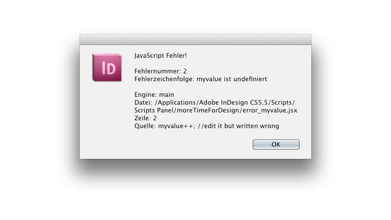
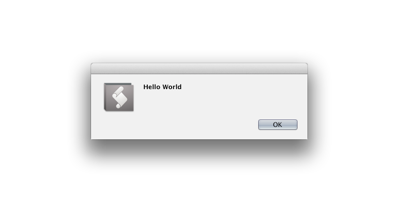
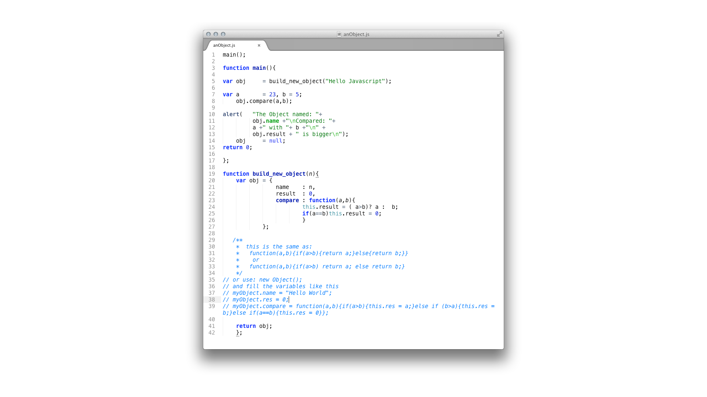
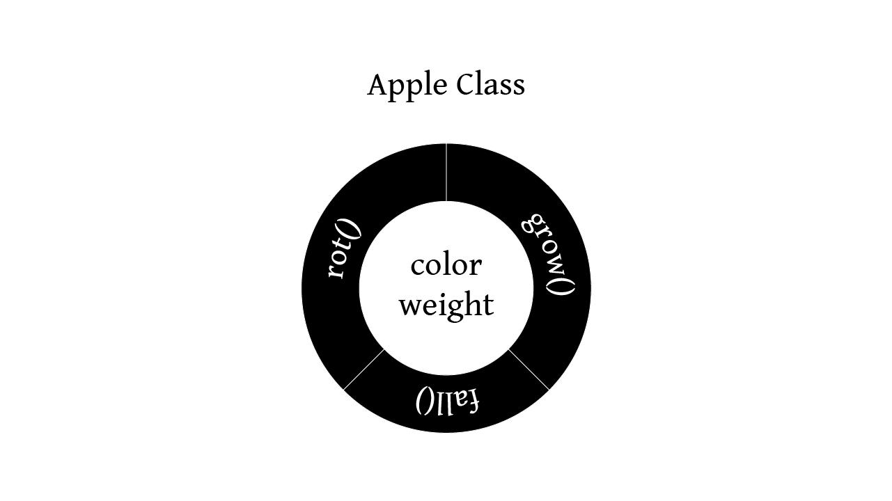
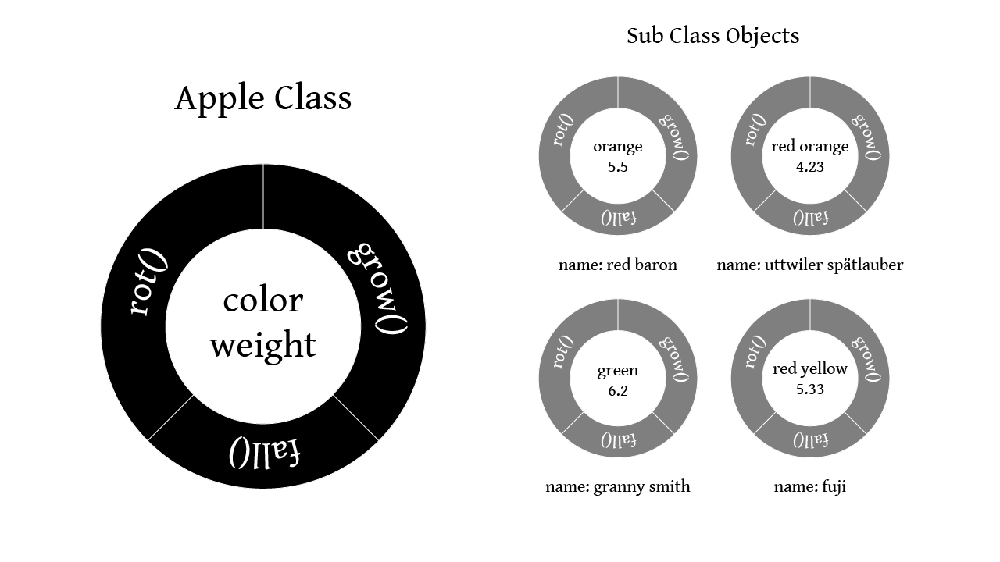
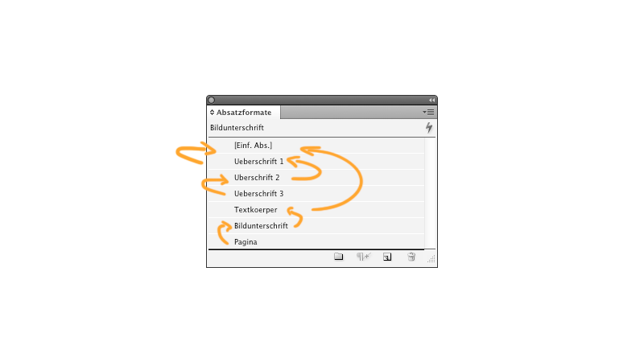
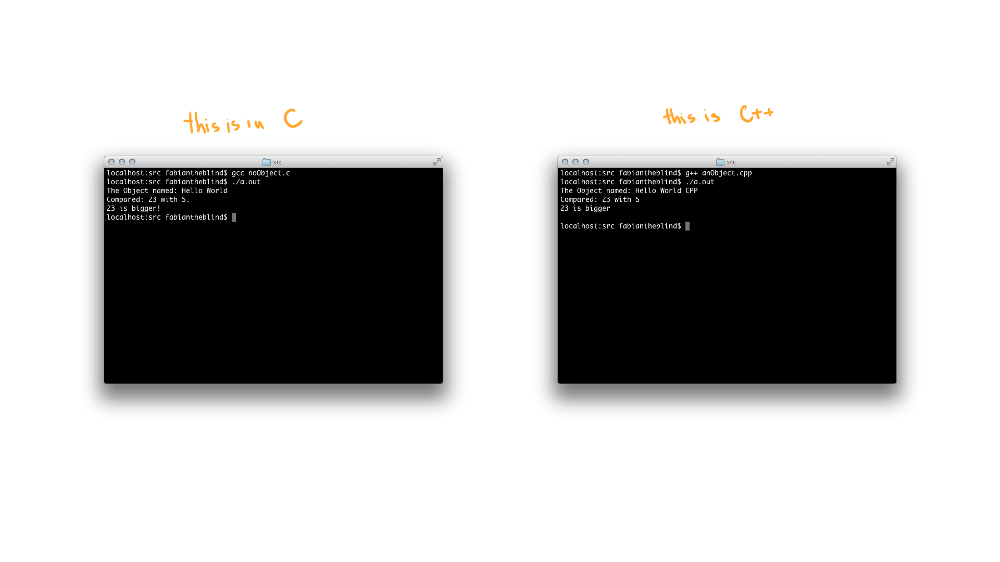
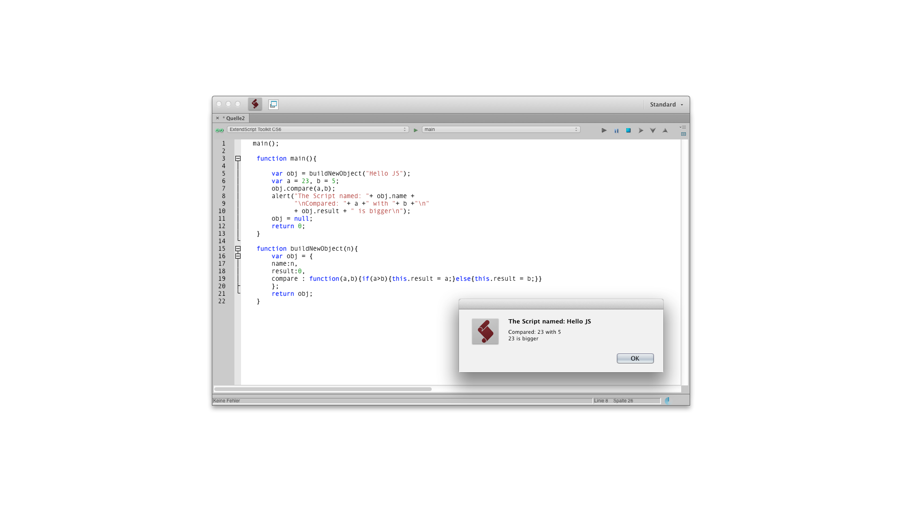
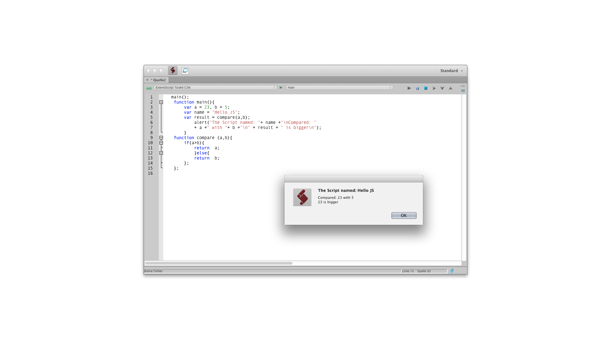

##7 Die kleine Terminologie 
Dieser Abschnitt ist zur Erläuterung gedacht und um den Lesefluss nicht durch sekundär Informationen und Erklärungen von FAchbegriffen zu unterbrechen. 

###Was ist Code? 
Als Code bezeichnen wir in der Regeln Informationen die verschlüsselt (encoding) werden um dann an einer weiteren Stelle wieder entschlüsselt zu werden (decoding). Zum Beispiel stellt Morse-Code Buchstaben dar indem ein einziges unmoduliertes Signal, zum Beispiel ein Ton, in kurze und lange Sequenzen unterteilt wird. Der Rezipient kann dann, wenn er des Systems mächtig ist, diese Informationen entschlüsseln und zu der originalen Nachricht wieder zusammensetzen. Ein weiters Bespiel ist der Abakus. Dieser erlaubt es wenn der Benutzer des Systems mächtig ist Rechenoperationen auszuführen. Und als drittes die Knotenschrift der Inkas die wie der Name bereits besagt aus einem System von Knoten auf einem Satz Schnüren bestand. Heutzutage findet das Wort "Code" im Computerbereich oft Verwendung als Kurzform des Ausdrucks "Source-Code" also Quelltext eines [Programms](#15).  
  
###Was ist ein Programm? 
Das Bild das viele im Kopf haben wenn sie das Wort Programm hören ist stark durch Film beeinflusst. Wir sehen junge, meist übergewichtig und verpickelte Menschen vor uns die in abgedunkelten Räumen zwischen Monitoren, Kabeln und Pizzapackungen auf ewige grün leuchtende Zahlenkolonnen blicken die für uns keinerlei Sinn ergeben. Diese oder ähnliche Bilder sind inspiriert aus einer Zeit in der Computer nur einfarbige Pixel hatten und Grafische Benutzeroberflächen wie Windows noch aus der Kommandozeile gestartet wurde. Als Hommage an diese Vorstellung hat "Duiker101" das Programm [HackerTyper](http://hackertyper.net/) entworfen welches mit bereits vorgegebenem Text allein über Tastendruck den Bildschirm mit kompliziertem Quelltext füllt. Dabei ist es irrelevant welche Tasten der Benutzer drückt.
Verwerfen sie diese Vorstellung (Es ist nicht so das es dies nicht gibt dennoch entspricht es nicht der Regel). Ein Programm ist lt. [Duden](http://www.duden.de/rechtschreibung/Programm): "die nach einem Plan genau festgelegten Einzelheiten eines Vorhabens". Unter dieser Betrachtungsweise ist jede Bauanleitung zu Möbelstücken, eine Beschreibung des Weges von hier zum Bahnhof oder das Rezept für Sahnetörtchen ein Programm. Bloß das in letzterem Fall nicht ein Computer die Anweisungen ausführt sondern ein Mensch. Die Sprache in der dieses Programm geschrieben ist, ist Deutsch. Der grosse Unterschied zu einem Computersprache/-programm liegt hier ein der Möglichkeit der Interpretation. Die Ausführende "Maschine" (in diesem Fall der Mensch) kann solche Angaben wie "eine Priese Salz" oder "eine Messerspitze Meerrettich" verarbeiten. Ein Computer ist hierzu (noch) nicht fähig. Er bräuchte eine eindeutigere Angabe wie 50 Gramm. Das Programm sollte an dieser Stelle noch von dem Begriff des [Algorithmus](#16) abgetrennt werden.  

###Was ist ein Algorithmus? 
Auch wenn sich diese beiden Begriffe in ihrer Bedeutung teilweise überschneiden sollten sie auf folgende weise unterschieden werden. Der Algorithmus für Milch holen wäre in Pseudocode:  

	wenn (Aussage (kein Milch ist im Kühlschrank) wahr ist): hole neue Milch! wenn nicht: tue nichts!  

Das Programm für Milch holen würde voraussetzen das alle Schritte und Notwendigkeiten bis zum Übergang der Milch in das Eigentum der Holenden bekannt und definiert sind. Also so etwas wie:  

	Person fabian ist gleich neu Person;
	Kühlschrank Schrank ist gleich neuer Kühlschrank;
	Kühlschrank Menge Milch ist gleich 1;
	jeden morgen fabian trinke Milch aus Kühlschrank;
	Menge Milch reduziere um 0.2l;
	jeden morgen fabian beobachte Menge Milch;
	wenn Milch kleiner gleich 0.1 ist fabian hohle Milch im Supermarkt;

Und so weiter und so ähnlich. Diese Funktionsanweisungen könnten noch detaillierter ausgearbeitet werden. Hierbei sei zu beachten das solche Objekte wie Kühlschrank und Person bereits implementiert also bekannt sind. Das Programm im Vergleich zum Algorithmus muss alle eingesetzten Mittel kennen und oder selber beschreiben.  
  
###Was ist die Syntax? 
Die Syntax ist die Form in der die Programmiersprache ausgestaltet ist. Die Syntax einer Programmiersprache besteht aus reservierten Worten wie zum Beispiel in Java `new, while, null , true,` Operatoren wie  `+,-,*,.` und Kontrollstrukturen wie `if(){}else{}` oder "`for(int i = 0; i < x;i++)`  
Lesen sie diese "Sätze" kurz. Wie würden sie es sprechen?  
  
Ausgesprochen wäre dies: ` For int i gleich 0, i kleiner x, i plus plus `

Es gibt in JavaScript eine Hand voll [reservierter Worte (Mozilla Developer Network)](https://developer.mozilla.org/en/JavaScript/Reference/Reserved_Words) die beim schreiben nicht verwendet werden dürfen.

break, case, catch, continue, debugger, default, delete, do, else, finally, 
for, function, if, in, instanceof, new, return, switch, this, throw, try, typeof, 
var, void, while, with, null, false, true 

Noch einmal. Diese Worte dürfen nur für bestimmte Aufgaben verwendet werden! Wenn also ein Programmierer seine Variable `null` nennet, wird das Programm beim ausführen eine Fehler auswerfen. Die obig genannten Strukturen, Operatoren und reservierten Worte müssen erlernt werden. Eine vollständige Beschreibung aller würde jedoch den Rahmen dieser Arbeit sprengen.  
Weiterhin ist beim schreiben von Programmen auch auf die Groß- und Kleinschreibung zu achten. Eine Variable die mit dem Namen `myValue` initiiert wird muss auch mit diesem Namen aufgerufen werden. Bei einer falschen Schreibweise `MyValue` oder `myvalue` würde das Programm warnen, dass die aufgerufene Variable nicht existiert.  


	var myValue = 5; // define a variable
	myvalue++; //edit it but written wrong


  

Es gibt Sprachen die versuchen ihre Syntax so weit wie möglich an unseren Sprachen zu orientieren, zum Beispiel Applescript:


	tell application "Safari" to activate


und wieder andere wie die esoterische Programmiersprache* "Brainfuck" die mit ihren acht Zeichen  


	+ - < > [ ] , .


voll funktionsfähig, aber nicht für das schreiben von Programmen gedacht ist sondern eher ein Gedankenmodell darstellt.
Das Brainfuck Hello World ([aus wiki](http://en.wikipedia.org/wiki/Brainfuck)):  


 	+++++ +++++             initialize counter (cell #0) to 10
 	[                       use loop to set the next four cells to 70/100/30/10
 	    > +++++ ++              add  7 to cell #1
 	    > +++++ +++++           add 10 to cell #2 
 	    > +++                   add  3 to cell #3
 	    > +                     add  1 to cell #4
 	    <<<< -                  decrement counter (cell #0)
 	]                   
 	> ++ .                  print 'H'
 	> + .                   print 'e'
 	+++++ ++ .              print 'l'
 	.                       print 'l'
 	+++ .                   print 'o'
 	> ++ .                  print ' '
 	<< +++++ +++++ +++++ .  print 'W'
 	> .                     print 'o'
 	+++ .                   print 'r'
 	----- - .               print 'l'
 	----- --- .             print 'd'
 	> + .                   print '!'
 	> .                     print '\n' 
  

Wie bereits oben in der Beschreibung des Milchalgorithmus zu sehen ist verwendet selbst Pseudocode ein nicht genau definierte Syntax lehnt sich jedoch mit Konstruktionen wie "ist gleich" an die Mathematik und Programmierung an. Andere Sprachen mit denen wir uns noch später Auseinandersetzen wie C++, Processing oder JavaScript sind zwischen diesen Extrema angesiedelt und vereinen in einer für das geübte Auge lesbaren und dennoch kompakte Art die Befehlsaufrufe.
  
###Was ist Pseudocode? 
Im Verlaufe dieser Arbeit werde ich immer wieder auf die Darstellung von Algorithmen in "Pseudocode" zurückgreifen. Pseudocode besteht nicht aus einer bereits definierten Syntax und kann auch nicht von einem [Compiler](#19) übersetzt werden sondern dient nur zur Darstellung eines logischen Ablaufs. Wie bereits in dem Milchalgorithmus zu sehen war versucht Pseudocode einen Programmablauf in menschenlesbarer Form darzustellen.  
  
###Was ist ein Compiler? 
Der Vollständigkeit halber soll dieser hier erklärt werden auch wenn er uns kaum mehr im weiteren Verlauf der Arbeit begegnen wird. Der Compiler ist ebenfalls ein Programm das aus menschenlesbaren Hochsprachen wie zum Beispiel C++ maschinenlesbaren Quelltext erzeugt (Assemblercode). Diesen Prozess bezeichnet man auch als Kompilierung.  
  
###Was ist eine IDE (Integrated Development Envoirement)? 
Um Quelltext zu schreiben bedarf es nicht viel. Ein einfacher Texteditor reicht aus um komplette Programme zu schreiben. Im Laufe der Zeit wurde jedoch viel Software programmiert um das schreiben von Quelltext zu erleichtern. Dies geht los bei einfachem Syntax-Highlighting bis hinzu kompletten Entwicklungsumgebungen die noch vor dem Kompilieren beziehungsweise während des Schreibens die Syntax auf ihre Validität prüfen und gegebenenfalls Vorschläge machen was gemeint sein könnte oder bei nicht verwendeten Programmteilen warnen das diese derzeit unnütz sind. In unserem Fall-Beispiel werden wir noch mit diesen Programmen zu tuen kriegen. Es sei jedoch bereits gesagt das wir die einfachste Möglichkeit nutzen werden die sich uns bietet und die auf beiden Plattformen (Windows und Mac OS X) zur Verfügung steht. Das ExtendScript Toolkit.  

###Was ist Hello World?  
Das "Hello World" Programm hat sich als Standard Beispiel etabliert um die Syntax einer Sprache zu erklären. Exerzieren wir das einmal kurz durch. Um für Adobe InDesign, After Effects, Illustrator, Photoshop, Photoshop Elements, Photoshop Elements Organizer, Bridge, Audition, Media Encoder und Premiere Pro Skripte zu schreiben liefert Adobe eine eigene [IDE, eine Integrierte Entwicklung Umgebung](#20), mit.  
   
Das ExtendScript Toolkit. Dies ist nicht der schönste Editor. Er hat jedoch einige Vorteile die die Entwicklung von Skripten sehr einfach macht. Die wichtigste Eigenschaft ist dabei folgende. Es kann ein Skript ohne es zu speichern ausführen. Das Toolkit wird bei der Installation von Adobe Produkten direkt mit geliefert. Suchen sie es in ihren Dienstprogrammen dort sollten sie fündig werden. Wenn nicht gehen sie zu dieser Webseite [http://www.adobe.com/devnet/scripting.html](http://www.adobe.com/devnet/scripting.html), laden und installieren sie es.  
Wenn es dann installiert ist geben sie folgende Text ein:  


	alert("Hello World");


und drücken sie auf den "Play/Run" Knopf oben rechts oder drücken sie CMD-r oder CTRL-r, abhängig von ihrer Platform.  
   

Herzlichen Glückwunsch. Ihr erstes JavaScript.  
Um dieses Skript in InDesign oder Photoshop auszuführen muss die Ziel Applikation aus dem PullDown Menü auf der oberen Leiste gewählt werden. Beim öffnen ist es auf ExtendScript Toolkit gestellt. Wählen sie dort InDesign aus. Das Toolkit wird sofort fragen ob InDesign auch gestartet werden soll. Bestätigen sie das und führen sie das Skript noch einmal aus. Sie werden sehen, dass der Computer zu InDesign überwechselt und den gleichen Hinweis gibt.  
Probieren sie weiter Skripte und Kalkulationen aus. Zum Beispiel  


 	var h = "Hello";
 	var w = "World";
 	var calc = (10*50)/23 - 1;
 	alert(h + " " + w +"! Your result is: "+ calc ); 
  
  

  
###Was ist Syntax-Highlighting? 
  

Syntax-Highlighting ist eine Hilfestellung für Programmierer um ihren Quelltext übersichtlicher zu gestalten. Hierbei werden bestimmte Teile wie Operatoren, Kommentare, Funktionsdeklarationen oder Reservierte Worte farblich hervorgehoben beziehungsweise zurückgenommen um das Lesen zu erleichtern.  
  
###Was ist eine API (Application Programming Interface)? 
Dies ist die Schnittstelle die ein Programm bietet um auf sein Funktionen zugreifen zu können. Dies wird beim Schreiben von Programmen wie InDesign von den Programmierern definiert. Diese Schnittstelle ist wie ein Baum mit Querverweisen aufgebaut. Um in InDesign einem bestehendem Dokument auf der ersten Seite eine Textbox hinzuzufügen muss durch diesen Baum manövriert werden.  

	app.activeDocument.pages.item(0).textFrames.add();

Diese Zeile erzeugt in der linken oberen Ecken eine Textkiste.  
All diese Befehle und Eigenschaften müssen nicht auswendig gelernt werden sondern können nachgeschlagen werden. Im ExtendScript Toolkit kann unter Hilfe / ObjektModell Viewer ein Hilfsprogramm aufgerufen werden das alle Befehle mit einer kurzen Erklärung enthält. Oder es kann auf der Seite von jongware eine .chm Datei heruntergeladen werden die die gleichen Informationen enthält und mit einem .chm Viewer durchsucht werden kann. [http://www.jongware.com/idjshelp.html](http://www.jongware.com/idjshelp.html)  
  
###Was ist Objektorientierung? 
Als Objektorientierung (ach als OO abgekürzt) versteht man ein bestimmte Art wie Programme aufgebaut sind. Ein Objekt ist ein gekapselter Teil des Programmcodes der Schnittstellen und Methoden bietet und seine Eigenschaften an weiter Objekte vererben kann. Um dies besser zu verstehen möchte ein hervorragendes Beispiel aus "Processing: A Programming Handbook for Visual Designers and Artists" von Casey Reas and Ben Fry bemühen.  
####Klammer auf!
	{  

Der Proto-Apfel hat bestimmte Eigenschaften wie Gewicht und Farbe. Hinzu kommen bestimmte Methoden wie Fallen, Wachsen und Verrotten die durch die Eigenschaften beeinflusste werden können. [^proto]  

  
 Wenn nun ein Baum wächst und Äpfel produziert erzeugt er nach dem Bauplan des Proto-Apfels neue Äpfel und jedem werden bestimmte Werte übergeben.  
  
Der Baum erzeugt den Apfel und ruft kontinuierlich die Methode Wachsen auf. Hierbei wird der Wert des Gewichtes inkrementiert. Sind die Früchte dann reif wird abhängig vom Gewicht des einzelnen Apfels die Methode Fallen ausgelöst. Wenn der Apfel dann auf dem Boden liegt und die Methode Fallen beendet ist beginnt die Methode Verrotten ihre Arbeit. Die Farbe des Apfels verändert sich und das Gewicht wird wieder verringert.
Das bedeutet der Proto-Apfel selber wird nicht angerührt sondern Instanzen von diesem. Um dies noch auf die Spitze zu treiben haben wir nicht nur eine Art Apfel sondern verschieden Sorten. Also ist die Klasse Granny Smith und ein "Kind"-Klasse der Basisklasse Apfel. Granny Smith erbt alle Eigenschaften der Klasse Apfel ohne das sie neu implementiert werden müssen und bekommt noch eine weitere Eigenschaft: den Namen.

	} // Klammer zu.  
Dieses Konstruktionsweise spiegelt sich in nicht nur in der Programmierung wieder. Die Benutzung einiger Komponenten in unseren Werkzeugen ist genau nach diesem Prinzip organisiert.
####Eine weiter Klammer auf   

	{

In InDesign hat der Benutzer die Möglichkeit Absatz- und Zeichenformate anzulegen ohne die das setzen eines Buches eine wirklich Zeitraubende Angelegenheit wäre. Eine einfache Gruppe von Absatzformaten kann wie folgt aufgebaut sein.  
- [Einfacher Absatz]  
- TextKörper  
- Überschrift 1  
- Überschrift 2  
- Überschrift 3  
- Bild Unterschrift  
- Pagina  
In dem Format "[Einfacher Absatz]" wird eine Schriftart und eine Schriftgrösse definiert. Dieses Format ist das Proto-Format von dem sich alle weiteren Formate ableiten. Sie erben also alle die Eigenschaften Schrift (appliedFont) und die Schriftgrösse (pointSize). Das Format "Überschrift 1" (Ü1) bekommt dann eine eigene Schriftgrösse und einen fetten Schnitt der Schriftart. Im dem Format "Überschrift 2" (Ü2) wird dann festgelegt das nicht mehr das "[Einfacher Absatz]" Format als Basis Klasse benutzt wird sondern Ü1. Damit erbt Ü2 alle Eigenschaften von Ü1. In Ü2 wird dann nur noch eine neue Schriftgrösse festgelegt. Das gleiche kann dann mit "Überschrift 3" (Ü3) passieren. Ü3 basiert auf Ü2 und bekommt ebenfalls eine eigene Schriftgrösse. Jetzt basiert Ü3 auf Ü2, das auf Ü1 und das auf "[Einfacher Absatz]". Ähnlich verfahren wir mit den weiteren Formaten. "Textkörper" basiert auf "[Einfacher Absatz]", "Bildunterschrift" auf "Textkörper" nur kleiner und "Pagina" auf "Bildunterschrift" aber mit 70% Deckkraft. Wenn der Gestalter nun entscheidet dass eine andere Schriftart von Nöten ist, ändert er sie nur in "[Einfacher Absatz]" und alle Kinder werden entsprechend angepasst. Dies ist ebenfalls Objektorientiert.  

	} // Klammer zu
[^proto]: Der Proto-Apfel existiert eigentlich nicht. Unsere Sprache lässt solche Ungenauigkeiten zu. Es gibt einen Apfel und einen Anderen. Aber nicht "DEN" Apfel.  

###Was sind Funktionen/Methoden? 
Eine Funktion oder eine Methode sind gekapselte Programmteile and die Parameter übergeben werden können und die an den gegebenen Parametern eine Kalkulation durchführen. Sie können dann Werte zurückgeben. Dies ist nützlich wenn bestimmte Tätigkeiten an unterschiedlichen Positionen eins Programms oder Skripts mehrmals aufgerufen werden müssen.     
###Was ist ein Bug? 
Ein Bug ist ein Fehler der das Programm von seiner einwandfreien Ausführung abhält. Dies kann nur ein Rechenfehler sein oder ein Fehler der das gesamte Programm zum Absturz bringt.  
  
###Was ist Debugging? 
Dies ist der Prozess des Finden und korrigieren von Fehlern.  

###Was ist ein Workaround?   
Ein Workaround ist eine kreative Lösung um ein Problem zu umgehen. Wenn zum Beispiel eine API ein bestimmte Funktion nicht anbietet muss ein Weg um dieses Problem drumherum gefunden werden. 
  
###Welche Konventionen gibt es? 
Neben den Bestimmungen der Syntax gibt es verschiedene Konventionen die das lesen von Skripten einfacher machen sollen. Zum Beispiel ist es gang und gebe dass die Funktionsweise am Beginn eines Skripts in einem Kommentar erklärt wird. Oder die Verwendung der Variable i (für Iterator) als Zähler in Schleifen.

###Herkunft von JavaScript 
JavaScript orientiert sich in seiner Syntax an C und C++. 
Zur Veranschaulichung was dies bedeutet hier ein Programm das folgende Aufgaben erledigt.  

- Zwei Zahlen  in Variablen definieren
- Ein Objekt mit folgenden 3 Eigenschaften erzeugen  
- Einem Namen  
- Einer Funktion die 2 Zahlen mit einander vergleicht und feststellt welche die grössere von beiden ist.  
- Eine Ergebnis zurück geben  
- Einen Satz aus allen Variablen zusammenstellen
- Diesen Satz darstellen
  
Dieses Programm liegt hier in verschiedenen Sprachen vor.  
Ich werde hier kurz auf kleine Unterschiede eingehen und versuchen an diesen 3 Beispielen zu erläutern warum JavaScript eine einfach und mächtige Sprache ist. An dieser Stelle ist es nicht zwingend den Programmcode komplett zu verstehen. Beachten sie nur die syntaktischen Unterschiede. Vergleichen sie die Funktion oder Methode `int Object::compare(int a, int b)` in C++ mit `int compare(int a, int b)` in C und betrachten sie danach die Funktion / Objekt `compare : function(a,b){if(a>b){return a;}else{return b;}` in JavaScript. Es gibt kleine Unterschiede aber die gemeinsame Herkunft ist unübersehbar. Eine tiefere Erklärung des Quelltextes findet sich in den Kommentaren der einzelnen Programme und des Skriptes.  

####Assembler (anObject.s)
Dies ist die Variante die die Maschine versteht. Es wurde jedoch nicht von mir geschrieben sondern ist das Ergebnis des Kompilierungs-Prozesses des C++ Programms. Näher wäre nur noch Nullen und Einsen zu schrieben. Ich drucke dies hier der Vollständigkeit halber ab. Ja - es gibt auch diesen Aspekt der Programmierung der genau dem entspricht was Menschen davon abhält sich mit ihr auseinander zu setzen. Um dort an zu gelangen ist es ein weiter Weg den wenige gehen und auch wir nicht beschreiten werden in dieser Arbeit. Aus Platzgründen werde ich hier nur die ersten 29 Zeilen zeigen. Das gesamte Programm in Assembler Code ist über 700 Zeilen lang und ist im Download Packet enthalten.  


		.section	__TEXT,__text,regular,pure_instructions
		.globl	__ZN6Object7compareEii
		.align	1, 0x90
	__ZN6Object7compareEii:
	Leh_func_begin1:
		pushq	%rbp
	Ltmp0:
		movq	%rsp, %rbp
	Ltmp1:
		movq	%rdi, -8(%rbp)
		movl	%esi, -12(%rbp)
		movl	%edx, -16(%rbp)
		movl	-12(%rbp), %eax
		movl	-16(%rbp), %ecx
		cmpl	%ecx, %eax
		jle	LBB1_2
		movl	-12(%rbp), %eax
		movl	%eax, -24(%rbp)
		jmp	LBB1_3
	LBB1_2:
		movl	-16(%rbp), %eax
		movl	%eax, -24(%rbp)
	LBB1_3:
		movl	-24(%rbp), %eax
		movl	%eax, -20(%rbp)
		movl	-20(%rbp), %eax
		popq	%rbp
		ret
	Leh_func_end1:

(…)  

Gruselig oder nicht? Zu unserem Glück müssen wir so etwas weder schreiben noch lesen können. Von 1969 bis 1973 würde die Sprache C von Dennis Ritchie ( Quelle The C Programming Language von Brian W. Kernighan & Dennis Ritchie) im "Bell Labs Computing Sciences Research Center" entwickelt. Diese Sprache wird beim Kompilieren in Assembler Code übersetzt. Der Vorteil dabei ist eine viel einfachere Syntax die es erlaubt den Schwerpunkt der Aufmerksamkeit auf das Konzept des Programms zu richten.   

####ANSI C noObject.c  
Im Unterschied zu C++ und JavaScript ist die Sprache C nicht für eine Objektorientierung ausgelegt. Deshalb hier einmal das Beispiel noObject.c welches die gestellte Aufgabe des Vergleich löst aber kein Objekt erzeugt. Die Syntax ähnelt hier sehr der von JavaScript. Sobald jedoch [Pointer](#32) hinzukommen wird es schwer kompliziert.

Aber ich schweife ab. Keine Sorge mit Problemen wie: "In welchem Speicher lege ich meine Variable ab" und "Habe ich auch den Müll rausgetragen" (Das löschen eines unbenutzten Objekts wird "Garbadge Collection" also "Müll sammeln" genannt), werden wir in JavaScript nicht konfrontiert. All diese Funktionalität wird von der Maschine im Hintergrund erledigt. Somit bleibt Zeit sich mit der Funktionsweise und Konzept zu beschäftigen. Stellen sie es sich vor wie es wäre entweder das Auto vor dem Fahren zusammen zu bauen oder einfach in das fertige Auto einzusteigen und loszufahren." Um die Abstammung von JavaScript verstehen zu können habe ich die Vergleichs-Funktion in C geschrieben.

// include the io lib
#include<stdio.h>
// the compare function takes integer as arguments 
int compare(int a, int b){
	if(a>b){return a;}else{return b;}
}
// the main function
int main(void){
	char name[11] = "Hello World"; // our string
	int a = 23,b = 5; // the values to compare
	// now print all that stuff
	// with %s you insert string arguments
	// with %d digits 
	printf("The Object named: %s\nCompared: %d with %d.\n%d is bigger!",name,a,b,compare(a,b));

	return 0;// everything went fine return 0
}
  

####C++ (anObject.cpp)  
Basierend auf C wurde Ende der Siebziger Anfang der Achtziger Jahre des letzten Jahrtausends die Sprache C++ von Bjarne Stroustrup in den AT&T Labs entwickelt (Quelle: Bjarne\_Stroustrup\_-\_The\_C++\_Programming\_Language\_3rd\_Ed [online](http://www.ib.cnea.gov.ar/~oop/biblio/Bjarne_Stroustrup_-_The_C++_Programming_Language_3rd_Ed.pdf)). Diese Sprache ist nach dem Konzept der Objektorientierung (OO) aufgebaut. In diesem Beispiel ist bereits zu sehen, dass die Menge an Code die geschrieben werden muss geringer wird (im Vergleich zum Assembler Code). Wobei hier wie auch im C Beispiel bedacht werden muss, dass bereits vorhandene Programmteile mit weiteren hunderten oder tausenden Zeilen Code hinzugefügt werden. [^oo]

#include <iostream>
#include <string> 
  
  
Mit den obigen 2 Zeilen werden fertige Klassen eingebunden. "iostream" um die Ein- und Ausgabe des Programms zu handhaben und "string" um Zeichenketten zu verarbeiten. Der Unterschied ist enorm. Während in C eine Zeichenkette noch eine Liste einzelner Zeichen ist wird in C++ ein Zeichenkette als ein einziges Objekt gehandhabt und bringt viele Funktionen mit zur Verarbeitung dieser.  



// the string and io classes
#include <iostream>
#include <string>

//using namespace std; // if you use this you can remove all "std::"
class Object{ /* our object*/
public:
	std::string name; // its name

	Object(){}// basis constructor
	Object(std::string in){name = in;}// another constructor
	int compare(int a, int b);//Prototype for comparsion
	void setName(std::string in){name = in;} // to set the name
};

int Object::compare(int a, int b){/* the compare function*/
	if(a>b){return a;}else{return b;}
}

int main(){ /* now the main program*/
	Object* myObject = new Object("Hello World CPP");// make a new object

	int a = 23,b = 5;// declare some values
	// now the output directly with comparsion
	std::cout << "The Object named: "<< 
	myObject->name << "\nCompared: "
	<< a << " with "
	<< b << "\n" 
	<< myObject->compare(a,b) <<" is bigger\n" 
	<< std::endl;
	/* code */
	delete myObject; // remove the object from memory
	return 0; // everything went fine return 0
}

 
####JavaScript (anObject.js)  
Im Jahre 1995 wurde die Sprache LiveScript zusammen mit der 2.0 Version von Netscape (ein WEb-Browser) veröffentlicht und bald in JavaScript umbenannt (Quelle: JavaScript das Umfassende Handbuch). Wie in jedem Buch das sich mit JavaScript auseinandersetzt möchte auch ich hier sagen und es dabei belassen:  
######Java is to JavaScript like ham to hamster  
Mit JavaScript gehen wir einen Schritt weiter als in C++. Hier sind das Objekt, die Ein-/Ausgabe, der String bereits existent und müssen nicht neu implementiert noch eingebunden werden. Genau genommen ist in JavaScript fast alles ein Objekt. Der massgebende Unterschied ist dass die vorherigen Programme wirklich vollwertige Programme sind die nach dem Kompilieren aus der Kommandozeile ausgeführt werden können. Die JavaScript Variante benötigt ein Programm in dem es ausgeführt wird. Es ist also alleine nicht lauffähig. Dennoch - was wir in C++ in 8 Zeilen schreiben hat in JavaScript nur noch 4 Zeilen.


main(); // call the main function

function main(){ /* here wee go */

    var obj = buildNewObject("Hello JS"); // create a new Object
    var a = 23, b = 5; // define the values
    obj.compare(a,b); // let the object compare the values
    // and make the message
    alert("The Script named: "+ obj.name + 
          "\nCompared: "+ a +" with "+ b +"\n" 
          + obj.result + " is bigger\n");
    obj = null; // delete the object
    return 0; // everything went fine return 0
};

function buildNewObject(n){/* this is our object builder*/
    var obj = { /* create a json object*/
    name:n, /* its name is the incoming value*/
    result:0, /* this will be set by the compare object*/
    compare : function(a,b){if(a>b){this.result = a;}else if(a<b){this.result = b;}}
    };
    return obj; // return the new object
};
  
  
  

Werfen sie einen Blick auf die Funktion `buildNewObject(n)`.  
Dies ist eine kleine Abwandlung der `compare` Funktion die wir in der C++ Variante sehen. Die verbesserte Funktion kann die gegebenen Variablen vergleichen und in sich selber mit `this.result` das Ergebnis festlegen. Um eine solche Funktionalität in einer C++ zu erzeugen bedürfte es einiger Zeilen mehr.  
Ohne diese Erweiterung und ohne das Objekt würde das JavaScript es wieder der C Variante ähneln.


main();  
function main(){
   	var a = 23, b = 5;
   	var name = "Hello JS";
   	var result = compare(a,b);
       	alert("The Script named: "+ name +"\nCompared: "
       		  + a +" with "+ b +"\n" + result + " is bigger\n");
   	}
function compare (a,b){
   	if(a>b){
       	return  a;
       	}else{
       	return  b;
   	};
};


  

[^oo]: OO hat den Vorteil des Versteckens beziehungsweise Kapseln von Daten. Es kommt die Klasse hinzu. Sie erlaubt ganze Programmteile auszulagern und nur einen Schnittstille für ihre Benutzung zu liefern. Für genauere Erklärungen lesen sie den Abschnitt [7.11 Was ist Objektorientierung?](#24)  

###Was ist der Unterschied zwischen JavaScript und ExtendScript? 
JavaScript oder EcmaScript ist das was uns täglich in Webbrowsern solche Dinge bescherte wie Scrollen auf Knopfdruck oder Warnhinweise und ähnliches. ExtendScript ist ein Dialekt von JavaScript der von Adobe entwickelt wurde. Das bedeutet InDesign versteht JavaScript und ExtendScript aber ein Browser kann mit ExtendScript Befehlen nichts anfangen.  

###Was sind Pointer   
Ein Pointer ist der Verwies auf die Speicheradresse unter der eine Variable abgelegt ist. Das kann dann so aussehen:

double *dp, atof(char *);


>says that in an expression *dp and atof(s) have values of double, and that the argument of atof is a pointer to char.  

> aus The C programming Language By Brian W. Kernighan and Dennis M. Ritchie. Published by Prentice-Hall in 1988
([online]( http://net.pku.edu.cn/~course/cs101/2008/resource/The_C_Programming_Language.pdf))
